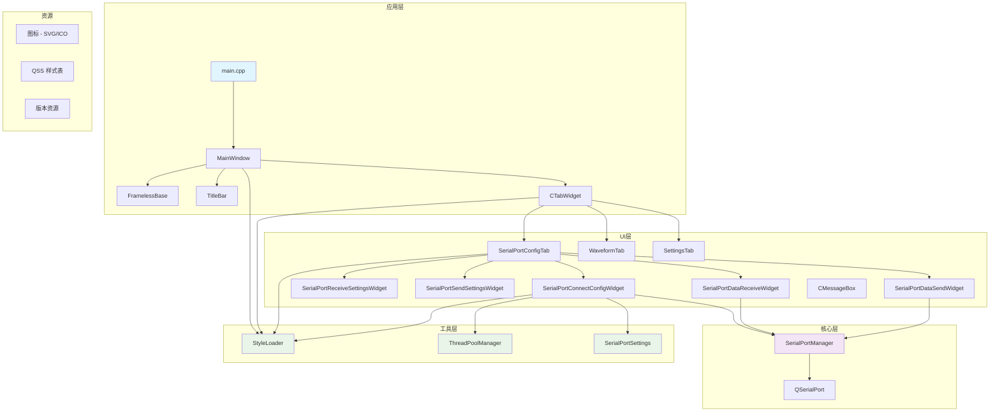
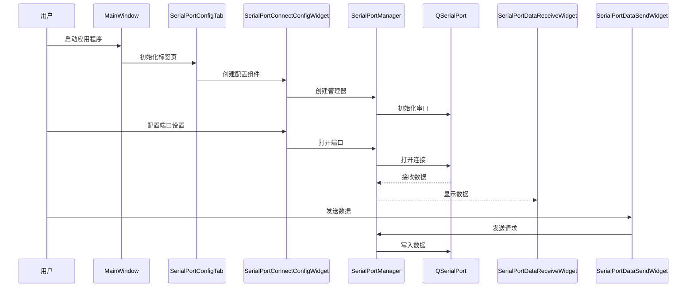

# IKUN 串口调试工具

一个基于 Qt6 和 C++20 构建的现代化、功能丰富的串口调试工具。该应用程序为串口通信提供了直观的界面，支持多种数据格式、实时监控和可定制的样式。

## 🚀 主要特性

- **现代化界面**: 无边框窗口设计，自定义标题栏和标签页界面
- **串口通信**: 功能完整的串口管理，支持可配置参数
- **数据格式**: 支持 ASCII 和 HEX 数据显示与传输
- **实时监控**: 实时数据接收和传输，支持自定义设置
- **多线程**: 使用 Qt 并发框架进行异步操作
- **可定制样式**: 基于 QSS 的主题系统，支持 SVG 图标
- **跨平台**: 基于 Qt6 构建，支持 Windows、Linux 和 macOS

## 📁 项目结构

```
serial_debug_tool/
├── src/                    # 源代码
│   ├── main.cpp           # 应用程序入口点
│   ├── core/              # 核心业务逻辑
│   │   └── SerialPortManager.cpp
│   ├── ui/                # 用户界面组件
│   │   ├── MainWindow.cpp
│   │   ├── TitleBar.cpp
│   │   ├── CTabWidget.cpp
│   │   ├── FramelessBase.cpp
│   │   ├── SerialPortConfigTab.cpp
│   │   ├── SerialPortConnectConfigWidget.cpp
│   │   ├── SerialPortDataReceiveWidget.cpp
│   │   ├── SerialPortDataSendWidget.cpp
│   │   └── [其他UI组件]
│   └── utils/             # 工具类
│       ├── StyleLoader.cpp
│       ├── ThreadPoolManager.cpp
│       └── SerialPortSettings.cpp
├── include/               # 头文件 (与src结构对应)
│   ├── core/
│   ├── ui/
│   └── utils/
├── resources/             # 应用程序资源
│   ├── icons/            # SVG 和 ICO 图标
│   ├── qss/              # Qt 样式表
│   └── version.rc        # Windows 版本资源
├── cmake-build-debug/     # 调试版本构建输出
├── cmake-build-release/   # 发布版本构建输出
├── Release/              # 最终发布二进制文件
├── tests/                # 单元测试 (空)
├── libs/                 # 外部库
└── CMakeLists.txt        # CMake 构建配置
```

## 🏗️ 系统架构

### 项目模块组成图

> **注意**: 如果您的Markdown渲染器不支持Mermaid图表，可以：
> 1. 在GitHub上查看（GitHub支持Mermaid渲染）
> 2. 复制代码到 [Mermaid Live Editor](https://mermaid.live/) 查看
> 3. 使用支持Mermaid的编辑器（如Typora、VS Code等）



**架构说明**:
- **蓝色**: 应用程序入口
- **紫色**: 核心业务逻辑
- **绿色**: 工具和辅助类

### 目录结构图

> **提示**: 此图表展示了项目的完整目录结构和文件组织方式

```mermaid
graph TD
    A[serial_debug_tool/] --> B[src/]
    A --> C[include/]
    A --> D[resources/]
    A --> E[cmake-build-debug/]
    A --> F[cmake-build-release/]
    A --> G[Release/]
    A --> H[tests/]
    A --> I[libs/]
    A --> J[CMakeLists.txt]

    B --> B1[main.cpp]
    B --> B2[core/]
    B --> B3[ui/]
    B --> B4[utils/]

    B2 --> B21[SerialPortManager.cpp]

    B3 --> B31[MainWindow.cpp]
    B3 --> B32[TitleBar.cpp]
    B3 --> B33[CTabWidget.cpp]
    B3 --> B34[FramelessBase.cpp]
    B3 --> B35[SerialPortConfigTab.cpp]
    B3 --> B36[SerialPortConnectConfigWidget.cpp]
    B3 --> B37[SerialPortDataReceiveWidget.cpp]
    B3 --> B38[SerialPortDataSendWidget.cpp]
    B3 --> B39[其他UI组件...]

    B4 --> B41[StyleLoader.cpp]
    B4 --> B42[ThreadPoolManager.cpp]
    B4 --> B43[SerialPortSettings.cpp]

    C --> C1[core/]
    C --> C2[ui/]
    C --> C3[utils/]

    D --> D1[icons/]
    D --> D2[qss/]
    D --> D3[version.rc]

    D1 --> D11[*.svg, *.ico 文件]
    D2 --> D21[*.qss 样式表]

    style A fill:#e3f2fd
    style B fill:#f3e5f5
    style C fill:#e8f5e8
    style D fill:#fff3e0
```



### 数据流架构图

> **说明**: 此序列图展示了用户操作从启动到数据收发的完整流程



### 模块组成

应用程序采用分层架构模式：

#### **应用层**
- `main.cpp`: 应用程序入口点和初始化
- `MainWindow`: 继承自 FramelessBase 的主应用程序窗口

#### **UI层**
- **窗口管理**: `FramelessBase`、`TitleBar`、`CTabWidget`
- **串口界面**: `SerialPortConfigTab` 包含配置和数据组件
- **专用组件**: 连接配置、数据接收/发送、设置组件
- **工具UI**: `CMessageBox` 用于用户通知

#### **核心层**
- `SerialPortManager`: 中央串口通信管理
- 使用互斥锁保护的线程安全操作
- 基于信号槽的UI组件通信

#### **工具层**
- `StyleLoader`: 动态 QSS 样式表加载
- `ThreadPoolManager`: 异步任务管理
- `SerialPortSettings`: 串口配置工具

#### **资源**
- **图标**: 可缩放UI元素的SVG矢量图形
- **样式表**: 组件特定样式的QSS文件
- **版本信息**: Windows可执行文件元数据

### 数据流

1. **初始化**: MainWindow 创建包含串口配置的标签容器
2. **配置**: 用户通过UI组件配置串口参数
3. **连接**: SerialPortManager 与选定端口建立连接
4. **通信**: UI和串口之间的双向数据流
5. **显示**: 支持格式转换的实时数据可视化

## 🛠️ 技术栈

- **编程语言**: C++20
- **框架**: Qt 6.5.3
- **构建系统**: CMake 3.30+
- **多线程**: Qt Concurrent 与自定义线程池管理
- **样式**: Qt 样式表 (QSS) 与 SVG 图标支持
- **串口通信**: Qt SerialPort 模块

### 依赖项

- Qt6::Core
- Qt6::Gui
- Qt6::Widgets
- Qt6::Svg
- Qt6::SvgWidgets
- Qt6::SerialPort
- Qt6::Concurrent

## 🔧 构建

### 前置要求

- CMake 3.30 或更高版本
- Qt 6.5.3 或兼容版本
- C++20 兼容编译器 (MSVC 2019+, GCC 10+, Clang 12+)

### 构建说明

1. **克隆仓库**
   ```bash
   git clone <repository-url>
   cd serial_debug_tool
   ```

2. **配置 CMake**
   ```bash
   mkdir build
   cd build
   cmake .. -DCMAKE_PREFIX_PATH="path/to/qt6"
   ```

3. **构建项目**
   ```bash
   cmake --build . --config Release
   ```

4. **运行应用程序**
   ```bash
   ./IKUN.exe  # Windows
   ./IKUN      # Linux/macOS
   ```

### CMake 配置

项目使用自动 Qt 资源编译和部署：
- MOC、RCC 和 UIC 自动处理
- Qt DLL 和插件部署到输出目录
- 包含 SVG 插件支持用于图标渲染

## 🎨 自定义

### 样式定制
- 修改 `resources/qss/` 中的 QSS 文件以自定义主题
- 替换 `resources/icons/` 中的 SVG 图标以获得不同的视觉风格
- StyleLoader 支持运行时样式表重新加载

### 功能扩展
- 通过扩展 CTabWidget 类添加新标签页
- 在 SerialPortManager 中实现额外的串口协议
- 遵循现有UI模式创建自定义组件

## 📝 许可证

[许可证信息待添加]

## 👥 贡献者

- **wangxiangyu** - 初始开发和架构设计

## 🐛 已知问题

- 测试目录当前为空 (单元测试待实现)
- WaveformTab 功能为占位符 (未来增强功能)

## 🔮 未来增强

- 串口数据波形可视化
- 常见串口协议分析器
- 数据记录和导出功能
- 自定义扩展插件系统

## 📊 关于架构图表

本README中包含的Mermaid图表可能在某些平台上显示为代码。为了最佳的查看体验，建议：

### **支持Mermaid的平台**:
- ✅ **GitHub**: 原生支持Mermaid渲染
- ✅ **GitLab**: 支持Mermaid图表
- ✅ **Typora**: Markdown编辑器，支持实时渲染
- ✅ **VS Code**: 配合Mermaid插件
- ✅ **Notion**: 支持Mermaid代码块

### **在线查看工具**:
- 🌐 [Mermaid Live Editor](https://mermaid.live/) - 在线编辑和查看
- 🌐 [Mermaid Chart](https://www.mermaidchart.com/) - 官方在线工具

### **本地查看方法**:
1. 将Mermaid代码复制到上述在线工具
2. 使用支持Mermaid的Markdown编辑器
3. 在GitHub上查看此README文件
