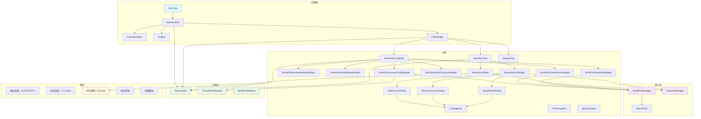
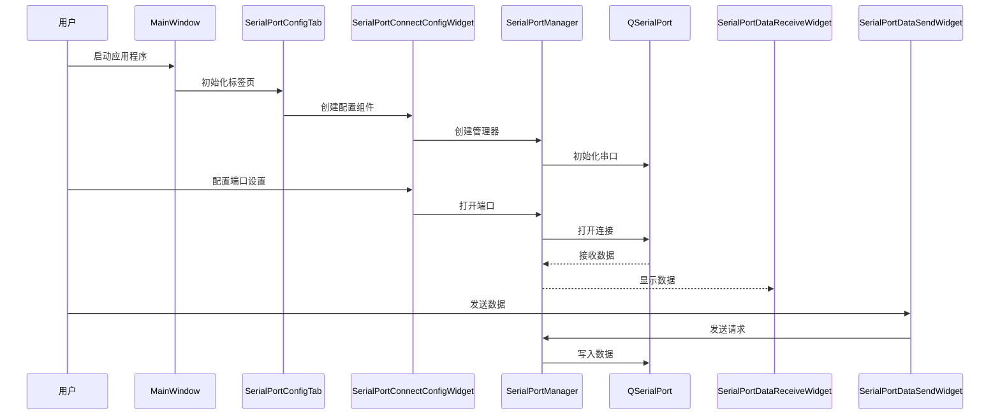

# IKUN 串口调试工具

一个基于 Qt6 和 C++20 构建的现代化、功能丰富的串口调试工具。该应用程序为串口通信和TCP网络通信提供了直观的界面，支持多种数据格式、实时监控、专业级数据可视化和完全可定制的样式系统。集成了基于 ECharts 的波形显示功能，支持多通道数据管理和实时图表更新。新增JavaScript脚本引擎支持自定义数据处理和协议解析。

---

> 💡 **如果您觉得这个项目对您有帮助，请点击右上角的 ⭐ Star 支持一下，这是对我最大的鼓励！**
>
> ⚠️ **声明：本项目仅供学习研究使用，请勿用于商业用途。**

## 📖 使用说明

### 🔗 项目地址
```
https://gitee.com/wangxiangyu123444/serial_debug_tool.git
```

### 📋 自定义脚本示例

以下是四种典型的数据传输和解析场景，帮助您快速上手本工具的数据处理功能：

**说明**

在串口模块和TCP/IP模块自定义脚本使用是保持一致的。目前自定义脚本并不能支持很高的发送频率，最高只能支持1HZ（每秒），如果你需要很高的发送频率支持，只能使用默认的录波协议。

**默认录波协议说明**

当您不勾选"使用自定义脚本"选项时，软件将采用一套内置的默认协议来解析串口数据并进行录波。该协议格式简洁，易于在各种单片机（如STM32）上实现。

*协议格式*

默认协议是一种基于文本的键值对格式，其核心结构为：

```
ChannelID=Value
```

当您需要一次性发送多个通道的数据时，只需用**逗号（,）**将它们隔开即可。

```
ChannelID1=Value1,ChannelID2=Value2,ChannelID3=Value3,
```

*格式详解*

*ChannelID (通道标识符)*

- 等号 (=) 前面的部分。
- 它必须与您在软件通道管理器中设置的"通道标识符"完全一致。例如，如果您在软件中设置了一个通道，其标识符为 `ch1`，那么您单片机发送的ChannelID就必须是`ch1`。
- 前后的空格会被自动忽略。例如 `ch1 = 123,` 是有效的。

*Value (数值)*

- 等号 (=) 后面的部分。
- 它可以是整数或小数（例如 `100` 或 `-50.25`）。
- 程序会将其解析为双精度浮点数（double）。
- 前后的空格同样会被自动忽略。

*分隔符 (Separator)*

- 每个ChannelID=Value数据对之后，必须跟一个英文逗号 (,) 作为分隔符。
- 这个逗号非常重要，程序以此为依据来切分和确认一个完整的数据点。

*示例*

*发送单个数据点*
```
单片机发送：ch1=99.5,
```

*一次性发送多个数据点*
```
单片机发送：ch1=99.5,ch2=-50,ch1=99.8,
```

*包含空格的示例（同样有效）*
```
单片机发送：ch1 = 99.5 , ch2 = -50 ,
```

*STM32/C代码发送示例*

您可以在您的单片机项目中使用sprintf函数轻松地构建此格式的字符串。

```c
#include <stdio.h>
#include <string.h>

// 假设 data_buffer 是一个足够大的全局或静态 char 数组
// 假设 USART6_SendData 是您的串口发送函数

/**
  * @brief 发送符合默认录波协议的数据
  * @param channel_id_str: 通道标识符字符串 (e.g., "ch1")
  * @param value: 要发送的浮点数值
  * @retval None
  */
void Send_Default_Protocol_Data(const char* channel_id_str, float value)
{
    char data_buffer[50];
    
    // 使用 sprintf 格式化字符串，例如 "ch1=99.50,"
    int len = sprintf(data_buffer, "%s=%.2f,", channel_id_str, value);
    
    // 通过UART发送
    if (len > 0) {
        USART6_SendData((uint8_t*)data_buffer, len);
    }
}

// 调用示例：
// Send_Default_Protocol_Data("ch1", 99.5);
// Send_Default_Protocol_Data("ch2", -50.0);
```

*注意事项*

- **末尾的逗号**：请确保每条有效数据的末尾都有一个逗号，这有助于程序正确识别数据帧的结束。
- **数据流处理**：程序将串口数据视为连续的数据流。如果数据在逗号后还有剩余（例如 `ch1=100,ch2=5`），不完整的部分（`ch2=5`）会被缓存起来，等待下一个数据包的到来再进行拼接处理。

---

**场景一：自定义二进制协议（推荐）**

这是最灵活、最高效的方式，特别适合嵌入式系统。

- **适用场景**：需要高效、紧凑地传输二进制数据，且数据结构清晰。

*协议约定*

我们约定一个5字节长的数据帧格式：

| 字节位置   | 0      | 1      | 2         | 3         | 4      |
| ---------- | ------ | ------ | --------- | --------- | ------ |
| **含义**   | 帧头   | 通道ID | 数据高8位 | 数据低8位 | 帧尾   |
| **示例值** | `0xEB` | `0x01` | `0x00`    | `0xC8`    | `0xED` |

*STM32 发送端代码*

```c
void Send_Data(uint8_t channel_id, int16_t value)
{
    // 定义一个5字节的数组
    uint8_t data_frame[5];

    // 按照协议格式构建数据帧
    data_frame[0] = 0xEB; // 帧头
    data_frame[1] = channel_id; // 通道ID
    data_frame[2] = (uint8_t)(value >> 8);   // 数据高8位
    data_frame[3] = (uint8_t)(value & 0xFF); // 数据低8位
    data_frame[4] = 0xED; // 帧尾

    // 通过UART发送数据帧
	USART6_SendData(data_frame, 5);
}
```

*JavaScript 解析脚本*

```JavaScript
/**
 * 查找一个5字节的完整数据帧。
 */
function findFrame(buffer) {
    // 查找 0xEB ... 0xED 格式的5字节固定长度帧
    for (var i = 4; i < buffer.length; ++i) {
        if (buffer[i] === 0xED && buffer[i - 4] === 0xEB) {
            return i;
        }
    }
    return -1; // 没有找到完整帧
}

/**
 * 解析一个数据帧，支持多种通道。
 */
function parseFrame(frame) {
    if (frame.length !== 5 || frame[0] !== 0xEB || frame[4] !== 0xED) {
        return null; // 格式不对，丢弃
    }

    // 第1步：识别通道ID
    var channelId = frame[1];

    // 第2步：提取数据
    var value = (frame[2] << 8) | frame[3];
    if (value & 0x8000) { value -= 0x10000; } // 符号转换

    // 第3步：根据通道ID返回不同的对象
    // channelId 需要与您在软件中添加通道时的“通道标识符”一致
    switch (channelId) {
        case 1:
            return {
                displayText: "channel1: " + value, // 用于显示文本
                chartData: { channelId: "ch1", point: value } // 用于绘制图表
            };
        case 2:
            return {
                displayText: "channel2: " + value,
                chartData: { channelId: "ch2", point: value }
            };
    }
}

/**
 * 驱动函数 - 无需修改。
 */
function processBuffer(buffer) {
    var results = [];
    var bytesConsumed = 0;
    while (bytesConsumed < buffer.length) {
        var remainingBuffer = buffer.slice(bytesConsumed);
        var frameEndPos = findFrame(remainingBuffer);
        if (frameEndPos < 0) { break; }
        var frameSize = frameEndPos + 1;
        var completeFrame = remainingBuffer.slice(0, frameSize);
        var parsedObject = parseFrame(completeFrame);
        if (parsedObject) { results.push(parsedObject); }
        bytesConsumed += frameSize;
    }
    return { bytesConsumed: bytesConsumed, frames: results };
}
```

*关键点解析*

- **核心思想**：在 `parseFrame` 函数中使用 `switch (channelId)` 语句来区分不同的通道。
- **自定义**：您可以轻松地复制一个 `case` 模块，修改通道ID和 `displayText`，来适配您自己的协议。

------


**场景二：使用特定分隔符**

- **适用场景**：发送长度不固定的文本数据，例如GPS模块的NMEA语句或一些自定义的ASCII指令。

*协议约定*

- 数据格式为 `"ID=Value"`，例如 `"1=123.45"`。
- 每条数据都以一个**逗号** `,` 作为结束标志。

*STM32 发送端代码*

```c
void Send_Data(uint8_t channel_id, float value)
{
    char buffer[50];
    
    // 使用 sprintf 格式化字符串，例如 "1=25.50,"
    int len = sprintf(buffer, "%d=%.2f,", channel_id, value);
    
    // 通过UART发送
    if (len > 0) {
        USART6_SendData((uint8_t*)buffer, len);
    }
}
```


*JavaScript 解析脚本*

```JavaScript
/**
 * 查找分隔符 (逗号 ',' 的ASCII码是 44)。
 */
function findFrame(buffer) {
    for (var i = 0; i < buffer.length; ++i) {
        if (buffer[i] === 44) { // 查找逗号
            return i;
        }
    }
    return -1;
}

/**
 * 将字节数组转换为字符串，并按 "ID=Value" 格式解析。
 */
function parseFrame(frame) {
    // 将字节数组转换为字符串 (忽略最后的逗号)
    var frameAsString = "";
    for (var i = 0; i < frame.length - 1; ++i) {
        frameAsString += String.fromCharCode(frame[i]);
    }

    // 按等号分割
    var parts = frameAsString.split('=');
    if (parts.length === 2) {
        var channelId = parts[0];
        var value = parseFloat(parts[1]); // 解析数值

        if (!isNaN(value)) {
            return {
                displayText: "通道 " + channelId + " = " + value,
                chartData: { channelId: "ch" + channelId, point: value }
            };
        }
    }
    return null;
}

/**
 * 驱动函数 - 无需修改。
 */
function processBuffer(buffer) {
    // ... (此函数与上一个示例完全相同) ...
}
```

*关键点解析*

- **核心思想**：`findFrame` 的任务变成了寻找分隔符（这里是逗号）。`parseFrame` 则负责将收到的字节流先转换成字符串，再进行解析。


**场景三：使用固定长度**

- **适用场景**：协议非常简单，每个数据包的长度都完全一样，解析效率极高。

*协议约定*

- 所有数据帧的长度都是固定的 **8个字节**。
- **Byte 0**: 通道ID。
- **Byte 1-4**: 32位有符号整数值（大端模式）。
- **Byte 5-7**: 保留字节。

*STM32 发送端代码*

```c
void Send_Data(uint8_t channel_id, int32_t value)
{
    uint8_t data_frame[8];
    
    data_frame[0] = channel_id;
    data_frame[1] = (uint8_t)(value >> 24); // 数据高位
    data_frame[2] = (uint8_t)(value >> 16);
    data_frame[3] = (uint8_t)(value >> 8);
    data_frame[4] = (uint8_t)(value);      // 数据低位
    data_frame[5] = 0; // 保留字节
    data_frame[6] = 0;
    data_frame[7] = 0;
    
    USART6_SendData(data_frame, 8);
}
```


*JavaScript 解析脚本*

```JavaScript
const FRAME_LENGTH = 8; // 在脚本开头定义好固定长度

/**
 * 检查数据是否足够一个完整帧的长度。
 */
function findFrame(buffer) {
    if (buffer.length >= FRAME_LENGTH) {
        return FRAME_LENGTH - 1; // 返回第一个完整帧的结束索引
    }
    return -1;
}

/**
 * 按照固定的字节位置来解析数据。
 */
function parseFrame(frame) {
    if (frame.length === FRAME_LENGTH) {
        var channelId = frame[0];
        var value = (frame[1] << 24) | (frame[2] << 16) | (frame[3] << 8) | frame[4];
        
        return {
            displayText: "通道 " + channelId + " = " + value,
            chartData: { channelId: "ch" + channelId, point: value }
        };
    }
    return null;
}

/**
 * 驱动函数 - 无需修改。
 */
function processBuffer(buffer) {
    // ... (此函数与上一个示例完全相同) ...
}
```

*关键点解析*

- **核心思想**：`findFrame` 的逻辑变得极其简单，只检查长度。`parseFrame` 则像操作数组一样，直接从固定的索引（`frame[0]`, `frame[1]`...）中提取数据。

---

**编写脚本的重要注意事项**

为了确保您自定义的脚本能够被软件正确识别和执行，请务必遵循以下的数据结构约定。这些结构是软件与脚本之间交互的“契约”，任何改动都可能导致脚本无法正常工作。

*1. parseFrame 函数的返回结构*

`parseFrame` 函数负责解析单个数据帧，它返回的对象必须遵循以下固定结构。

```javascript
return {
    // displayText: [字符串],  // (可选) 用于在文本框中显示的字符串
    // chartData: {           // (可选) 用于绘制图表的对象
    //     channelId: [字符串], // (必选, 如果有chartData) 与软件中设置的通道标识符一致
    //     point: [数值]      // (必选, 如果有chartData) 用于绘图的数据点
    // }
};
```

*字段详解*：

**displayText (可选)**：
- 类型：字符串。
- 作用：定义了希望在软件的文本显示区看到的内容。如果您只需要绘图，可以省略此字段。

**chartData (可选)**：
- 类型：对象。
- 作用：定义了用于绘制图表的数据。如果您只需要显示文本，可以省略此字段。
- 但请注意：如果提供了 `chartData` 对象，那么它内部的 `channelId` 和 `point` 两个字段都必须存在。

**chartData.channelId (必选, 如果有chartData)**：
- 类型：字符串。
- 作用：告诉软件这个数据点属于哪个通道。这个值必须与您在软件通道管理器中设置的“通道标识符”完全一致（例如 "ch1", "ch2"）。

**chartData.point (必选, 如果有chartData)**：
- 类型：数值。
- 作用：图表上Y轴的实际数值。

**关键**: 以上所有键名 (displayText, chartData, channelId, point) 都是固定的，请勿修改，否则软件将无法识别。

*2. processBuffer 函数的返回结构*

`processBuffer` 是软件直接调用的核心入口函数，其返回结构绝对不能改变。

```javascript
return {
    bytesConsumed: [数值], // (必选) 本次调用成功处理的字节数
    frames: [数组]       // (必选) 由 parseFrame 返回的对象组成的数组
};
```

*字段详解*：

**bytesConsumed (必选)**：
- 类型：数值（整数）。
- 作用：告知软件本次函数调用处理了输入缓冲区中的多少个字节。软件会根据这个值来清理缓冲区，为下一次数据处理做准备。

**frames (必选)**：
- 类型：数组。
- 作用：一个数组，其中包含了本次调用中，所有被 `parseFrame` 成功解析出的数据对象。

**关键**: `bytesConsumed` 和 `frames` 这两个键名以及它们的数据类型是脚本与软件交互的唯一接口，任何改动都会导致整个脚本失效。

## 🚀 本地部署

- 环境要求

  - CMake 3.30 或更高版本
  - Qt 6.5.3 或兼容版本
  - C++20 兼容编译器 (MSVC 2019+, GCC 10+, Clang 12+)
  - CLion开发与打包

- 编译配置

  

  

  

  

  

  

- 部署配置

  

  

  

  

  

- 运行说明

  

  运行时如果出现黑色控制台需要在CMakeList中恢复相关配置。（恢复的话用qDebug无法输出打印日志）

  

## 🌟 核心特性

### 🖥️ 现代化界面
- **启动画面**: 专业的 SplashScreen 启动界面，提升用户体验
- **无边框窗口**: 自定义 FramelessBase 基类，支持窗口拖拽和边缘调整大小
- **自定义标题栏**: 集成最小化、最大化、关闭按钮的现代化标题栏
- **标签页界面**: 三个主要功能标签页（串口配置、波形显示、设置）
- **SVG 图标系统**: 18个可缩放的矢量图标，支持高DPI显示
- **自定义对话框**: 带动画效果的圆角对话框系统

### 📡 串口通信
- **完整串口管理**: 自动检测可用串口，支持所有标准串口参数配置
- **多种波特率**: 1200-115200 bps 全范围支持
- **数据位配置**: 5-8 数据位可选
- **校验位设置**: 无校验、奇校验、偶校验
- **停止位选择**: 1位、1.5位、2位停止位
- **流控制**: 无流控、硬件流控、软件流控
- **1MB 缓冲区**: 大容量串口读取缓冲，支持高速数据传输

### 🌐 TCP网络通信
- **TCP客户端模式**: 连接到远程TCP服务器，支持IP地址和端口配置
- **TCP服务器模式**: 作为服务器监听连接，支持多客户端同时连接
- **实时连接状态**: 显示连接状态和客户端信息
- **数据格式支持**: ASCII/HEX双格式显示和发送
- **时间戳和来源标识**: 自动标识数据来源和接收时间
- **定时发送**: 支持自定义间隔的定时数据发送

### 📊 数据处理与可视化
- **双格式显示**: ASCII 和 HEX 格式实时切换
- **时间戳功能**: 可选的毫秒级时间戳显示 [HH:mm:ss.zzz]
- **数据保存**: 实时数据保存到文件，支持文件选择和导出
- **数据清除**: 一键清除接收数据显示
- **自动滚动**: 可选的自动滚动到最新数据
- **专业波形显示**: 基于 ECharts 的实时数据波形显示
- **多通道支持**: 支持多个数据通道同时显示和管理
- **采样率配置**: 支持自定义采样率设置，优化数据采集性能
- **iKUN示波器**: 集成专业级示波器功能，支持数据点符号显示

### ⚡ 高级功能
- **定时发送**: 支持自定义间隔的定时数据发送
- **HEX 发送**: 十六进制格式数据发送
- **发送回显**: 可选的发送数据在接收区显示
- **多线程处理**: 异步数据读写，确保界面响应性
- **线程安全**: 使用互斥锁保护串口操作
- **通道管理**: 单例模式的通道管理器，支持动态添加/删除通道
- **Web引擎集成**: QWebEngineView 集成 ECharts 实现专业级数据可视化
- **数据队列优化**: 支持大容量数据缓冲和批量处理 (60FPS刷新率)
- **资源清理**: 程序退出时自动清理 WebEngine 缓存
- **JavaScript脚本引擎**: 支持自定义JavaScript脚本进行数据处理和协议解析
- **实时帧同步**: 自动检测和解析数据帧，支持复杂协议处理
- **代码编辑器**: 内置高亮显示JavaScript代码编辑器，支持深色/浅色主题切换
- **数据包处理器**: 单独线程处理串口和TCP数据，支持高并发数据流

## 📁 项目结构

```
serial_debug_tool/
├── src/                    # 源代码 (31个文件)
│   ├── main.cpp           # 应用程序入口点 (包含SplashScreen集成)
│   ├── core/              # 核心业务逻辑 (4个文件)
│   │   ├── SerialPortManager.cpp          # 串口管理核心类
│   │   ├── ChannelManager.cpp             # 通道管理器 (单例模式)
│   │   ├── TcpNetworkManager.cpp          # TCP网络管理核心类
│   │   └── ScriptManager.cpp              # JavaScript脚本管理器
│   ├── ui/                # 用户界面组件 (26个文件)
│   │   ├── MainWindow.cpp                 # 主窗口
│   │   ├── SplashScreen.cpp               # 启动画面
│   │   ├── TitleBar.cpp                   # 自定义标题栏
│   │   ├── CTabWidget.cpp                 # 标签页容器
│   │   ├── FramelessBase.cpp              # 无边框窗口基类
│   │   ├── CDialogBase.cpp                # 对话框基类 (带动画效果)
│   │   ├── CMessageBox.cpp                # 自定义消息框
│   │   ├── SerialPortConfigTab.cpp        # 串口配置标签页
│   │   ├── SerialPortConnectConfigWidget.cpp    # 串口连接配置
│   │   ├── SerialPortReceiveSettingsWidget.cpp  # 接收设置面板
│   │   ├── SerialPortSendSettingsWidget.cpp     # 发送设置面板
│   │   ├── SerialPortDataReceiveWidget.cpp      # 数据接收显示
│   │   ├── SerialPortDataSendWidget.cpp         # 数据发送输入
│   │   ├── SerialPortRealTimeSaveWidget.cpp     # 实时保存状态显示
│   │   ├── TcpNetworkConfigTab.cpp        # TCP网络配置标签页
│   │   ├── TcpNetworkClientWidget.cpp     # TCP客户端组件
│   │   ├── TcpNetworkServerWidget.cpp     # TCP服务器组件
│   │   ├── WaveformTab.cpp                # 波形显示标签页
│   │   ├── WaveformWidget.cpp             # ECharts 波形显示组件
│   │   ├── WaveformCtrlWidget.cpp         # 波形控制面板
│   │   ├── AddChannelDialog.cpp           # 添加通道对话框
│   │   ├── RemoveChannelDialog.cpp        # 移除通道对话框
│   │   ├── SampleRateDialog.cpp           # 采样率配置对话框
│   │   ├── ScriptEditorDialog.cpp         # JavaScript脚本编辑对话框
│   │   └── SettingsTab.cpp                # 设置标签页
│   └── utils/             # 工具类 (6个文件)
│       ├── StyleLoader.cpp               # QSS样式加载器
│       ├── ThreadPoolManager.cpp         # 线程池管理器
│       ├── SerialPortSettings.cpp        # 串口参数配置工具
│       ├── PacketProcessor.cpp           # 数据包处理器
│       └── JavaScriptHighlighter.cpp     # JavaScript代码高亮器
├── include/               # 头文件 (与src结构对应，31个文件)
│   ├── core/              # 核心模块头文件 (4个文件)
│   │   ├── SerialPortManager.h, ChannelManager.h
│   │   ├── TcpNetworkManager.h
│   │   └── ScriptManager.h
│   ├── ui/                # UI组件头文件 (26个文件)
│   │   ├── MainWindow.h, SplashScreen.h, TitleBar.h, CTabWidget.h
│   │   ├── FramelessBase.h, CDialogBase.h, CMessageBox.h
│   │   ├── SerialPortConfigTab.h, SerialPortConnectConfigWidget.h
│   │   ├── SerialPortReceiveSettingsWidget.h, SerialPortSendSettingsWidget.h
│   │   ├── SerialPortDataReceiveWidget.h, SerialPortDataSendWidget.h
│   │   ├── SerialPortRealTimeSaveWidget.h
│   │   ├── TcpNetworkConfigTab.h, TcpNetworkClientWidget.h, TcpNetworkServerWidget.h
│   │   ├── WaveformTab.h, WaveformWidget.h, WaveformCtrlWidget.h
│   │   ├── AddChannelDialog.h, RemoveChannelDialog.h, SampleRateDialog.h
│   │   ├── ScriptEditorDialog.h
│   │   └── SettingsTab.h
│   └── utils/             # 工具类头文件 (6个文件)
│       ├── StyleLoader.h, ThreadPoolManager.h, SerialPortSettings.h
│       ├── PacketProcessor.h, DataPacket.h, ThreadSetup.h
│       └── JavaScriptHighlighter.h, NetworkModeState.h
├── resources/             # 应用程序资源
│   ├── icons/            # SVG 和 ICO 图标文件 (22个图标)
│   │   ├── 界面图标: logo.svg, serial.svg, waves.svg, settings.svg, tcp_network.svg
│   │   ├── 操作图标: send.svg, checkmark_blue.svg, down_arrow.svg
│   │   ├── 波形图标: add_series.svg, remove_series.svg, clear_series.svg
│   │   ├── 数据图标: import_series.svg, export_series.svg
│   │   ├── 控制图标: start_series.svg, stop_series.svg, sample_rate.svg
│   │   ├── 功能图标: code.svg (脚本编辑), help.svg (帮助)
│   │   └── 应用图标: ikun.ico, ikun.svg, silder_ikun.svg, un_dev.svg
│   ├── qss/              # Qt 样式表文件 (21个样式文件)
│   │   ├── 主界面: main_window.qss, title_bar.qss, tab_bar.qss
│   │   ├── 对话框: dialog_base.qss, add_channel_dialog.qss, remove_channel_dialog.qss, sample_rate_dialog.qss
│   │   ├── 脚本编辑: script_editor_dialog.qss (新增)
│   │   ├── 波形界面: wave_form_tab.qss, wave_form_ctrl_widget.qss
│   │   ├── TCP网络: tcp_network_config_tab.qss, tcp_network_client_wdiget.qss, tcp_network_server_wdiget.qss (新增)
│   │   ├── 串口组件: serial_prot_config_tab.qss
│   │   ├── 串口配置: serial_port_connect_config_widget.qss
│   │   ├── 串口设置: serial_port_receive_settings_widget.qss, serial_port_send_settings_widget.qss
│   │   ├── 串口数据: serial_port_data_receive_widget.qss, serial_port_data_send_widget.qss
│   │   ├── 实时保存: serial_port_real_time_save_widget.qss
│   │   └── 设置页面: settings_tab.qss
│   ├── web/              # Web资源 (ECharts集成，2个文件)
│   │   ├── echarts.min.js                 # ECharts库文件 (压缩版)
│   │   └── wave.html                      # 波形显示HTML页面
│   └── version.rc        # Windows 版本资源
├── cmake-build-debug/     # 调试版本构建输出
├── cmake-build-release/   # 发布版本构建输出
├── Release/              # 最终发布二进制文件 (iKUN.exe)
├── tests/                # 单元测试目录 (待实现)
├── libs/                 # 外部库目录
├── deploy.bat            # Windows 部署脚本
└── CMakeLists.txt        # CMake 构建配置
```

## 🏗️ 系统架构

### 项目模块组成图

> **注意**: 如果您的Markdown渲染器不支持Mermaid图表，可以：
> 1. 在GitHub上查看（GitHub支持Mermaid渲染）
> 2. 复制代码到 [Mermaid Live Editor](https://mermaid.live/) 查看
> 3. 使用支持Mermaid的编辑器（如Typora、VS Code等）



**架构说明**:
- **蓝色**: 应用程序入口
- **紫色**: 核心业务逻辑
- **绿色**: 工具和辅助类

### 目录结构图

> **提示**: 此图表展示了项目的完整目录结构和文件组织方式

```mermaid
graph TD
    A[serial_debug_tool/] --> B[src/]
    A --> C[include/]
    A --> D[resources/]
    A --> E[cmake-build-debug/]
    A --> F[cmake-build-release/]
    A --> G[Release/]
    A --> H[tests/]
    A --> I[libs/]
    A --> J[CMakeLists.txt]

    B --> B1[main.cpp]
    B --> B2[core/]
    B --> B3[ui/]
    B --> B4[utils/]

    B2 --> B21[SerialPortManager.cpp]

    B3 --> B31[MainWindow.cpp]
    B3 --> B32[TitleBar.cpp]
    B3 --> B33[CTabWidget.cpp]
    B3 --> B34[FramelessBase.cpp]
    B3 --> B35[SerialPortConfigTab.cpp]
    B3 --> B36[SerialPortConnectConfigWidget.cpp]
    B3 --> B37[SerialPortDataReceiveWidget.cpp]
    B3 --> B38[SerialPortDataSendWidget.cpp]
    B3 --> B39[其他UI组件...]

    B4 --> B41[StyleLoader.cpp]
    B4 --> B42[ThreadPoolManager.cpp]
    B4 --> B43[SerialPortSettings.cpp]

    C --> C1[core/]
    C --> C2[ui/]
    C --> C3[utils/]

    D --> D1[icons/]
    D --> D2[qss/]
    D --> D3[version.rc]

    D1 --> D11[*.svg, *.ico 文件]
    D2 --> D21[*.qss 样式表]

    style A fill:#e3f2fd
    style B fill:#f3e5f5
    style C fill:#e8f5e8
    style D fill:#fff3e0
```



### 数据流架构图

> **说明**: 此序列图展示了用户操作从启动到数据收发的完整流程



### 详细功能模块

#### **应用层 (Application Layer)**
- **`main.cpp`**: 应用程序入口，设置应用名称为"IKUN"
- **`MainWindow`**: 主窗口类，继承自 FramelessBase，管理整体布局

#### **UI层 (User Interface Layer)**

**窗口框架组件**:
- **`FramelessBase`**: 无边框窗口基类
  - 支持窗口边缘拖拽调整大小
  - 自定义边框热区检测 (默认5px)
  - 鼠标悬停边框高亮显示
  - 完整的窗口拖拽和调整功能

- **`TitleBar`**: 自定义标题栏
  - Logo显示、最小化、最大化、关闭按钮
  - 窗口拖拽功能
  - 自定义样式支持

- **`CTabWidget`**: 标签页容器
  - 三个主要标签页：串口配置、波形显示、设置
  - SVG图标支持，24x24像素图标尺寸
  - 最小窗口尺寸：1000x700

**串口功能组件**:
- **`SerialPortConfigTab`**: 串口配置主标签页
  - 左右分栏布局：设置面板 + 数据面板
  - 集成所有串口相关功能组件

- **`SerialPortConnectConfigWidget`**: 串口连接配置
  - 串口自动检测和选择
  - 波特率、数据位、校验位、停止位、流控制配置
  - 连接/断开按钮
  - 防止ComboBox滚轮误操作

- **`SerialPortReceiveSettingsWidget`**: 接收设置面板
  - HEX/ASCII显示格式切换
  - 时间戳显示开关
  - 实时保存到文件功能
  - 清除数据和保存数据按钮

- **`SerialPortSendSettingsWidget`**: 发送设置面板
  - HEX发送格式选择
  - 定时发送功能 (可配置间隔)
  - 发送数据回显选项

- **`SerialPortDataReceiveWidget`**: 数据接收显示
  - QPlainTextEdit 大容量文本显示
  - 自动滚动功能
  - 支持数据格式实时切换
  - 线程安全的数据更新

- **`SerialPortDataSendWidget`**: 数据发送输入
  - 多行文本输入框
  - 发送按钮
  - 支持定时发送模式

- **`SerialPortRealTimeSaveWidget`**: 实时保存状态显示
  - 保存路径显示
  - 动画进度条 (带移动图标)
  - 保存状态可视化

**波形可视化组件**:
- **`WaveformTab`**: 波形显示标签页
  - 集成 WaveformWidget 和 WaveformCtrlWidget
  - 上下分栏布局：控制面板 + 波形显示区域

- **`WaveformWidget`**: ECharts 波形显示组件
  - 基于 QWebEngineView 集成 ECharts
  - 支持多通道数据同时显示
  - 实时数据更新和图表刷新
  - JavaScript 与 C++ 交互
  - 透明背景和性能优化设置

- **`WaveformCtrlWidget`**: 波形控制面板
  - 6个功能按钮：添加通道、移除通道、清除数据、导入、导出、开始/停止
  - 集成通道管理功能
  - 工具提示和用户友好界面

- **`AddChannelDialog`**: 添加通道对话框
  - 继承自 CDialogBase，带动画效果
  - 通道名称、ID、颜色配置
  - 输入验证和已有通道显示
  - 英文ID验证 (正则表达式)

- **`RemoveChannelDialog`**: 移除通道对话框
  - 继承自 CDialogBase，带动画效果
  - 显示已有通道列表，支持选择移除
  - 通道信息可视化显示 (颜色指示器 + 名称 + ID)
  - 专用的移除按钮样式 (红色主题)

- **`SampleRateDialog`**: 采样率配置对话框
  - 继承自 CDialogBase，带动画效果
  - 支持自定义采样率设置
  - 优化数据采集性能配置

**其他UI组件**:
- **`SplashScreen`**: 启动画面
  - 专业的启动界面设计
  - 异步加载主窗口
  - 提升用户体验

- **`CDialogBase`**: 对话框基类
  - 无边框圆角设计
  - 淡入动画效果 (QPropertyAnimation)
  - 标准确定/取消按钮布局
  - 可扩展的内容区域

- **`CMessageBox`**: 自定义消息提示框
- **`SettingsTab`**: 设置标签页 (基础框架)

#### **核心层 (Core Layer)**
- **`SerialPortManager`**: 串口通信核心管理器
  - 基于 QSerialPort 的封装
  - 线程安全操作 (QMutex 保护)
  - 原子操作标志位 (std::atomic<bool>)
  - 支持 HEX/ASCII 数据转换
  - 时间戳生成功能
  - 1MB 读取缓冲区
  - 异步数据读写处理
  - 完整的错误处理机制

- **`ChannelManager`**: 通道管理器 (单例模式)
  - 线程安全的通道信息管理
  - 支持添加、删除、更新、清除通道
  - 信号槽机制通知UI更新
  - ChannelInfo 结构体存储通道信息

#### **工具层 (Utils Layer)**
- **`StyleLoader`**: QSS样式表动态加载器
  - 支持从资源文件加载样式
  - 运行时样式更新
  - 颜色转换工具函数

- **`ThreadPoolManager`**: 线程池管理器
  - 基于 Qt Concurrent 框架
  - 支持任意函数和参数的任务添加
  - 安全的线程池关闭机制
  - 自动线程数量管理

- **`SerialPortSettings`**: 串口参数配置工具
  - 标准串口参数选项定义
  - ComboBox 自动配置功能
  - 默认值设置支持

#### **资源系统 (Resources)**
- **图标系统**: 17个SVG矢量图标 + 1个ICO图标 (共18个)
  - 串口功能图标：serial.svg, send.svg, checkmark_blue.svg
  - 波形功能图标：waves.svg, add_series.svg, remove_series.svg, clear_series.svg
  - 数据操作图标：import_series.svg, export_series.svg, start_series.svg, stop_series.svg
  - 配置图标：sample_rate.svg (采样率配置)
  - 界面图标：logo.svg, settings.svg, down_arrow.svg, un_dev.svg
  - 应用图标：ikun.ico, ikun.svg

- **样式系统**: 17个专用QSS样式表文件
  - 主界面样式：main_window.qss, title_bar.qss, tab_bar.qss
  - 对话框样式：dialog_base.qss, add_channel_dialog.qss, remove_channel_dialog.qss, sample_rate_dialog.qss
  - 波形样式：wave_form_tab.qss, wave_form_ctrl_widget.qss
  - 串口组件样式：8个 serial_port_*.qss 文件
    - serial_prot_config_tab.qss (配置标签页)
    - serial_port_connect_config_widget.qss (连接配置)
    - serial_port_receive_settings_widget.qss (接收设置)
    - serial_port_send_settings_widget.qss (发送设置)
    - serial_port_data_receive_widget.qss (数据接收)
    - serial_port_data_send_widget.qss (数据发送)
    - serial_port_real_time_save_widget.qss (实时保存)
  - 设置页面样式：settings_tab.qss

- **Web资源**: ECharts 集成 (2个文件)
  - echarts.min.js：ECharts 核心库 (压缩版)
  - wave.html：波形显示HTML页面，包含完整的图表配置和JavaScript交互

- **部署资源**:
  - deploy.bat：Windows自动部署脚本，支持最小化部署
  - version.rc：Windows可执行文件元数据

### 数据流架构

#### **应用启动流程**
1. **应用初始化**: main.cpp → QApplication → MainWindow 创建
2. **窗口构建**: FramelessBase → TitleBar + CTabWidget 布局
3. **标签页创建**: SerialPortConfigTab + WaveformTab + SettingsTab
4. **资源加载**: StyleLoader 加载QSS样式，图标资源初始化

#### **串口通信流程**
1. **串口检测**: ThreadPoolManager 异步检测可用串口
2. **参数配置**: SerialPortConnectConfigWidget → SerialPortManager
3. **连接建立**: SerialPortManager → QSerialPort 打开连接
4. **数据接收**: QSerialPort → SerialPortManager → SerialPortDataReceiveWidget
5. **数据发送**: SerialPortDataSendWidget → SerialPortManager → QSerialPort
6. **格式转换**: ASCII ↔ HEX 实时转换显示
7. **文件保存**: SerialPortRealTimeSaveWidget 实时数据保存

#### **波形可视化流程**
1. **通道管理**: AddChannelDialog → ChannelManager 添加通道
2. **Web引擎**: WaveformWidget → QWebEngineView 加载 wave.html
3. **ECharts初始化**: wave.html → echarts.min.js 图表创建
4. **数据绑定**: ChannelManager 信号 → WaveformWidget JavaScript调用
5. **实时更新**: 串口数据 → 通道数据 → ECharts 图表刷新
6. **交互控制**: WaveformCtrlWidget 按钮 → 数据导入导出操作

## 🛠️ 技术栈与特性

### 核心技术
- **编程语言**: C++20 (现代C++特性)
- **GUI框架**: Qt 6.5.3 (跨平台GUI框架)
- **构建系统**: CMake 3.30+ (现代构建工具)
- **并发处理**: Qt Concurrent + 自定义线程池
- **样式系统**: QSS (Qt Style Sheets) + SVG矢量图标
- **串口通信**: Qt SerialPort (跨平台串口支持)
- **Web技术**: QWebEngineView + ECharts (数据可视化)
- **JavaScript集成**: Qt-JavaScript 桥接技术

### 设计模式与架构
- **分层架构**: 应用层、UI层、核心层、工具层清晰分离
- **信号槽机制**: Qt信号槽实现组件间解耦通信
- **单例模式**: ChannelManager、ThreadPoolManager 全局管理
- **观察者模式**: 串口数据变化的实时UI更新
- **工厂模式**: SerialPortSettings 参数配置生成
- **模板方法模式**: CDialogBase 对话框基类设计
- **策略模式**: 数据格式转换 (ASCII/HEX)

### 性能优化
- **异步处理**: 串口读写操作不阻塞UI线程
- **内存管理**: 智能指针和RAII原则
- **缓冲机制**: 1MB串口读取缓冲区
- **原子操作**: std::atomic 保证线程安全
- **事件过滤**: 优化用户交互响应
- **Web引擎优化**: 禁用动画、启用硬件加速
- **延迟更新**: 避免频繁的图表重绘

### Qt模块依赖
- **Qt6::Core**: 核心功能、信号槽、线程管理
- **Qt6::Gui**: 基础GUI功能、事件处理
- **Qt6::Widgets**: 窗口组件、布局管理
- **Qt6::Svg**: SVG图标渲染支持
- **Qt6::SvgWidgets**: SVG组件集成
- **Qt6::SerialPort**: 串口通信核心
- **Qt6::Concurrent**: 并发任务处理
- **Qt6::WebEngineWidgets**: Web引擎集成 (ECharts支持)

## 🔧 构建

### 前置要求

- CMake 3.30 或更高版本
- Qt 6.5.3 或兼容版本
- C++20 兼容编译器 (MSVC 2019+, GCC 10+, Clang 12+)

### 构建说明

1. **克隆仓库**
   ```bash
   git clone <repository-url>
   cd serial_debug_tool
   ```

2. **配置 CMake**
   ```bash
   mkdir build
   cd build
   cmake .. -DCMAKE_PREFIX_PATH="path/to/qt6"
   ```

3. **构建项目**
   ```bash
   cmake --build . --config Release
   ```

4. **运行应用程序**
   ```bash
   ./IKUN.exe  # Windows
   ./IKUN      # Linux/macOS
   ```

### CMake 配置

项目使用自动 Qt 资源编译和部署：
- MOC、RCC 和 UIC 自动处理
- Qt DLL 和插件部署到输出目录
- 包含 SVG 插件支持用于图标渲染

## 🎨 自定义与扩展

### 样式定制
- **主题修改**: 编辑 `resources/qss/` 中的17个QSS文件
  - `main_window.qss`: 主窗口样式
  - `title_bar.qss`: 标题栏样式
  - `tab_bar.qss`: 标签页样式
  - `dialog_base.qss`: 对话框基础样式
  - `add_channel_dialog.qss`: 添加通道对话框样式
  - `remove_channel_dialog.qss`: 移除通道对话框样式
  - `sample_rate_dialog.qss`: 采样率配置对话框样式
  - `wave_form_tab.qss`: 波形标签页样式
  - `wave_form_ctrl_widget.qss`: 波形控制面板样式
  - `settings_tab.qss`: 设置标签页样式
  - `serial_port_*.qss`: 8个串口组件专用样式
- **图标替换**: 替换 `resources/icons/` 中的18个SVG/ICO图标
- **运行时更新**: StyleLoader 支持动态样式重载

### 功能扩展指南
- **新增标签页**: 继承 QWidget，在 CTabWidget 中注册
- **串口协议**: 在 SerialPortManager 中添加协议解析
- **数据处理**: 扩展数据格式转换和显示功能
- **UI组件**: 遵循现有命名和架构模式

### 开发建议
- 使用信号槽机制保持组件解耦
- 遵循线程安全原则，使用 ThreadPoolManager
- 保持QSS样式文件的模块化组织
- 新增功能时考虑跨平台兼容性

## 📊 性能指标与特性统计

### 性能指标
- **启动时间**: < 2秒 (包含串口检测和Web引擎初始化)
- **内存占用**: ~80MB (包含Web引擎，空闲状态)
- **数据处理**: 支持高达115200 bps波特率
- **缓冲容量**: 1MB串口读取缓冲
- **UI响应**: 异步处理保证界面流畅
- **文件保存**: 实时数据流保存无延迟
- **图表渲染**: ECharts硬件加速，支持大数据量实时更新

### 项目规模统计
- **源代码文件**: 31个 (.cpp文件)
  - main.cpp (1个) + core (4个) + ui (26个) + utils (6个)
- **头文件**: 31个 (.h文件)
  - 与源文件一一对应的完整头文件结构
- **UI组件**: 26个独立组件
  - 包含完整的对话框系统、启动画面、波形可视化组件、TCP网络组件和脚本编辑器
- **核心模块**: 4个 (SerialPortManager, ChannelManager, TcpNetworkManager, ScriptManager)
- **工具类**: 6个 (StyleLoader, ThreadPoolManager, SerialPortSettings, PacketProcessor, JavaScriptHighlighter, ThreadSetup)
- **图标资源**: 22个SVG + 1个ICO (共23个)
- **样式文件**: 21个QSS文件 (完整的样式系统)
- **Web资源**: 2个文件 (ECharts库 + HTML页面)
- **部署脚本**: 1个 (deploy.bat Windows部署脚本)
- **总文件数**: 约130个文件 (包含构建输出和图片资源)
- **代码行数**: 约18000行 (估算，包含注释和空行)

## 📝 许可证

[许可证信息待添加]

## 👥 开发团队

- **wangxiangyu** - 项目创始人、架构设计师、主要开发者
  - 负责整体架构设计和核心功能实现
  - 开发时间：2025年7月16日 - 2025年8月7日 (持续开发中)
  - 主要贡献：完整的UI系统、串口通信、波形可视化、通道管理系统

## 🐛 已知限制

- **测试覆盖**: 单元测试框架待实现 (tests目录为空)
- **设置功能**: SettingsTab 为基础框架，功能待完善
- **协议分析**: 暂不支持专用串口协议解析
- **数据导出**: 波形控制面板的导入导出功能待实现
- **多串口**: 当前仅支持单串口连接
- **Web引擎依赖**: 需要Qt WebEngine模块支持，增加了部署复杂性
- **内存占用**: Web引擎集成导致内存占用相对较高 (~80MB)
- **平台限制**: 主要针对Windows平台优化 (字体设置为Microsoft YaHei UI)

## ✨ 已实现的高级特性

- ✅ **专业启动体验**: SplashScreen 启动画面，异步加载主窗口
- ✅ **完整的波形可视化系统**: 基于ECharts的专业级数据可视化
- ✅ **多通道数据管理**: 支持动态添加/删除数据通道，完整的通道管理对话框
- ✅ **采样率配置**: SampleRateDialog 支持自定义采样率设置
- ✅ **实时数据流**: 串口数据到波形图表的实时更新，60FPS刷新率
- ✅ **现代化UI设计**: 无边框窗口、自定义对话框、动画效果
- ✅ **完整的样式系统**: 21个专用QSS文件，支持主题定制
- ✅ **线程安全架构**: 多线程数据处理，UI响应流畅
- ✅ **资源管理系统**: 完整的图标、样式、Web资源管理
- ✅ **三向通道操作**: AddChannelDialog、RemoveChannelDialog 和 SampleRateDialog 完整实现
- ✅ **数据队列优化**: 支持大容量数据缓冲和性能优化
- ✅ **Web引擎集成**: QWebEngineView 完美集成 ECharts 图表库
- ✅ **自动化部署**: deploy.bat 脚本支持一键部署
- ✅ **TCP网络通信**: 支持客户端和服务器模式，多客户端同时连接
- ✅ **JavaScript脚本引擎**: 完整的JS脚本执行环境，支持自定义数据处理
- ✅ **代码编辑器**: 内置高亮显示JavaScript编辑器，支持深色/浅色主题
- ✅ **智能帧同步**: 自动检测和解析数据帧，支持复杂协议处理
- ✅ **高性能数据处理**: PacketProcessor单独线程处理数据，支持高并发
- ✅ **多端口状态管理**: NetworkModeState统一管理串口和TCP的显示状态
- ✅ **线程池管理**: ThreadSetup模板化线程设置，支持多管理器线程化

## 🔮 发展路线

### 短期目标 (v2.0)
- 完善波形控制面板的数据导入导出功能
- 实现常见串口协议分析器 (Modbus, ASCII协议等)
- 完善设置页面 (主题选择、快捷键配置)
- 添加单元测试框架和自动化测试

### 中期目标 (v3.0)
- 插件系统架构，支持第三方扩展
- 多串口同时监控和数据对比
- 数据分析工具 (FFT、滤波、统计分析)
- 数据库存储支持 (SQLite/MySQL)
- 跨平台优化 (Linux、macOS完整支持)

### 长期愿景
- 成为专业级串口调试工具标杆
- 支持更多通信协议 (CAN, I2C, SPI, Ethernet等)
- 云端数据同步和远程监控
- 移动端支持 (Android/iOS)
- AI辅助数据分析和异常检测
- 工业级应用支持和认证

## 📊 关于架构图表

本README中包含的Mermaid图表可能在某些平台上显示为代码。为了最佳的查看体验，建议：

### **支持Mermaid的平台**:
- ✅ **GitHub**: 原生支持Mermaid渲染
- ✅ **GitLab**: 支持Mermaid图表
- ✅ **Typora**: Markdown编辑器，支持实时渲染
- ✅ **VS Code**: 配合Mermaid插件
- ✅ **Notion**: 支持Mermaid代码块

### **在线查看工具**:
- 🌐 [Mermaid Live Editor](https://mermaid.live/) - 在线编辑和查看
- 🌐 [Mermaid Chart](https://www.mermaidchart.com/) - 官方在线工具

### **本地查看方法**:
1. 将Mermaid代码复制到上述在线工具
2. 使用支持Mermaid的Markdown编辑器
3. 在GitHub上查看此README文件
