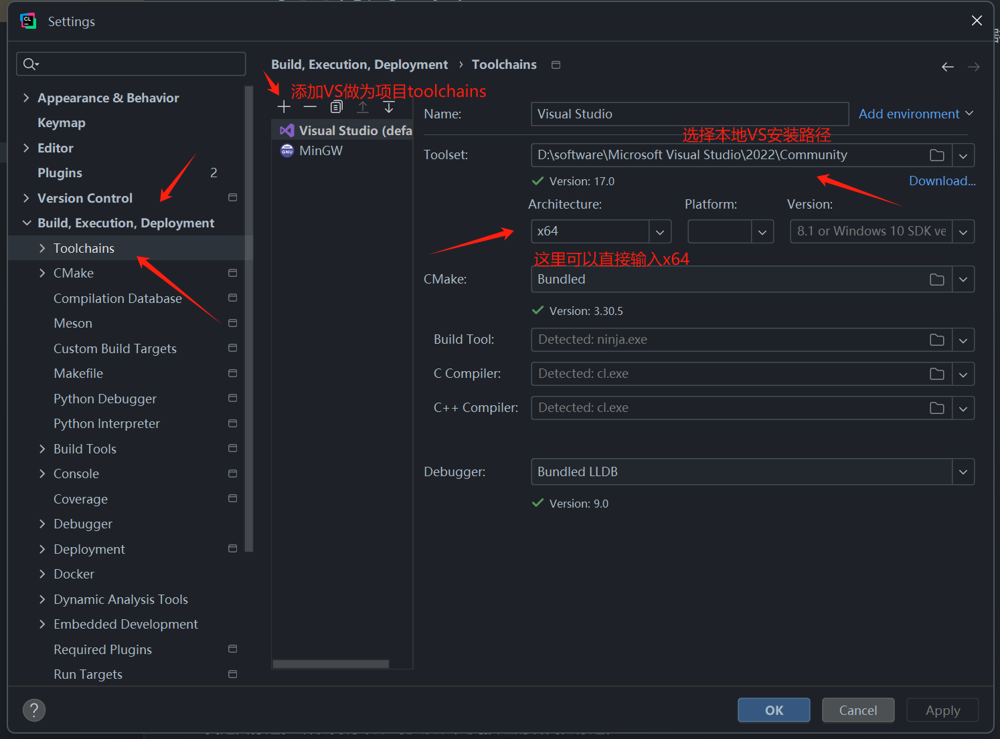
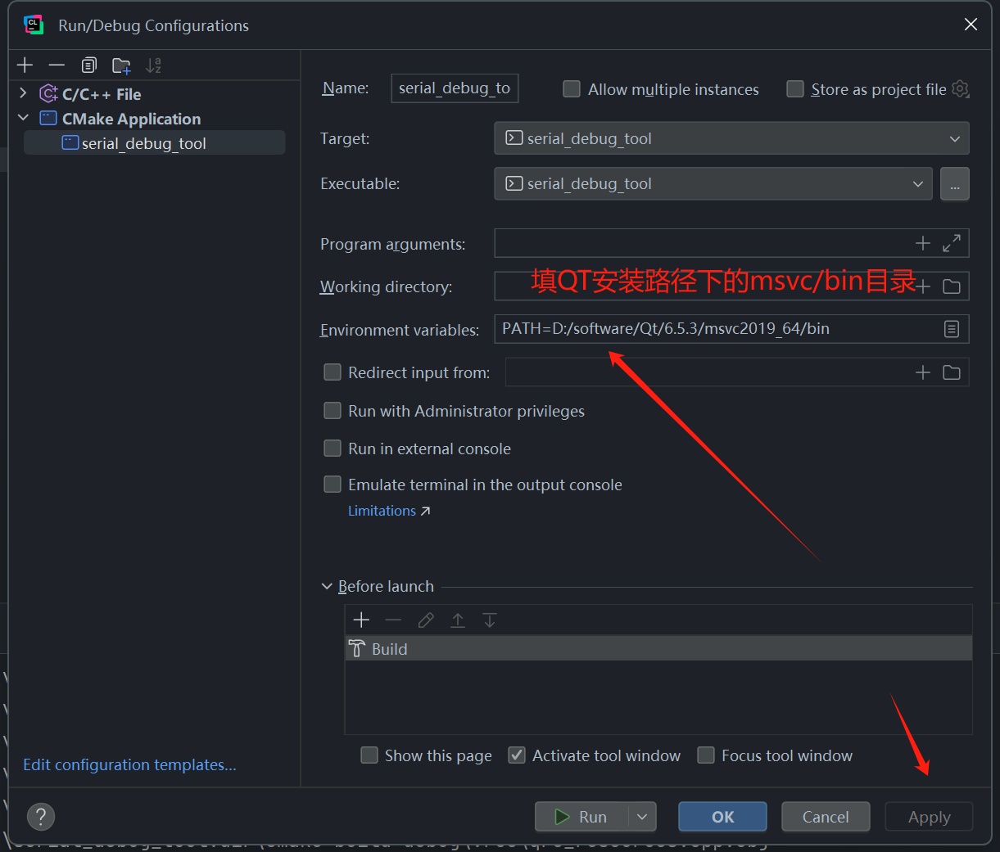
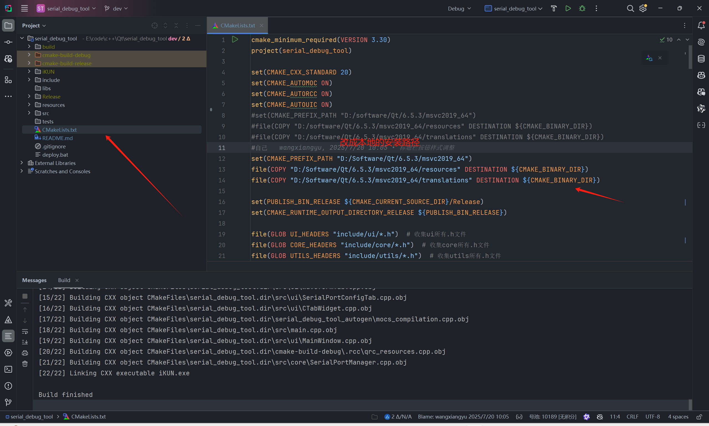
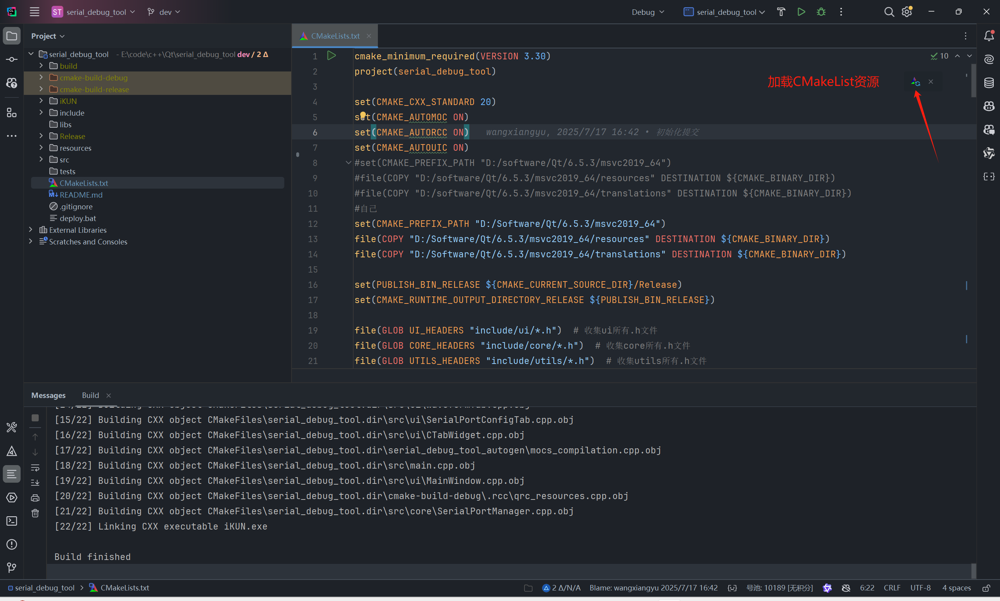
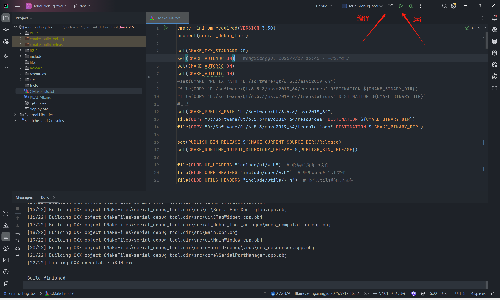
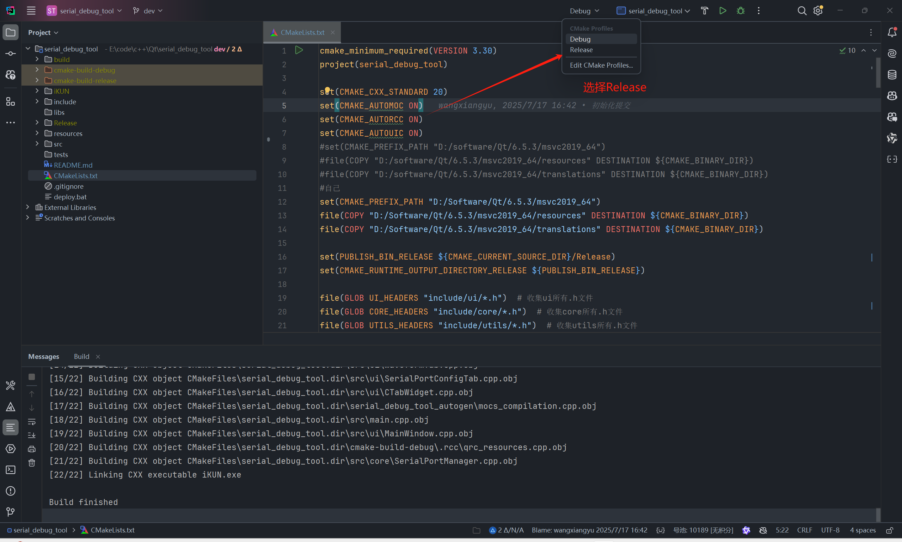
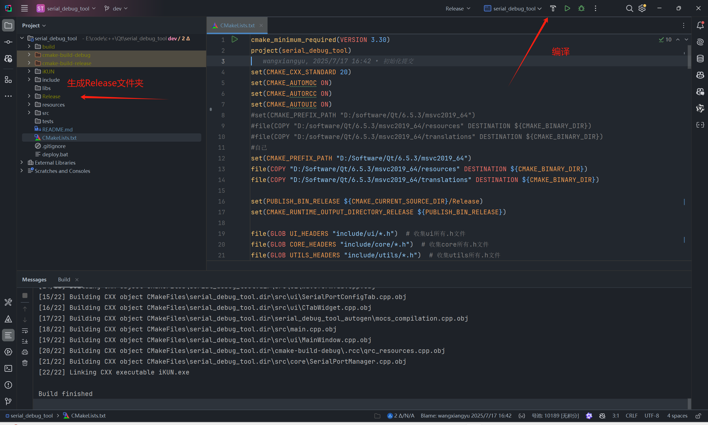
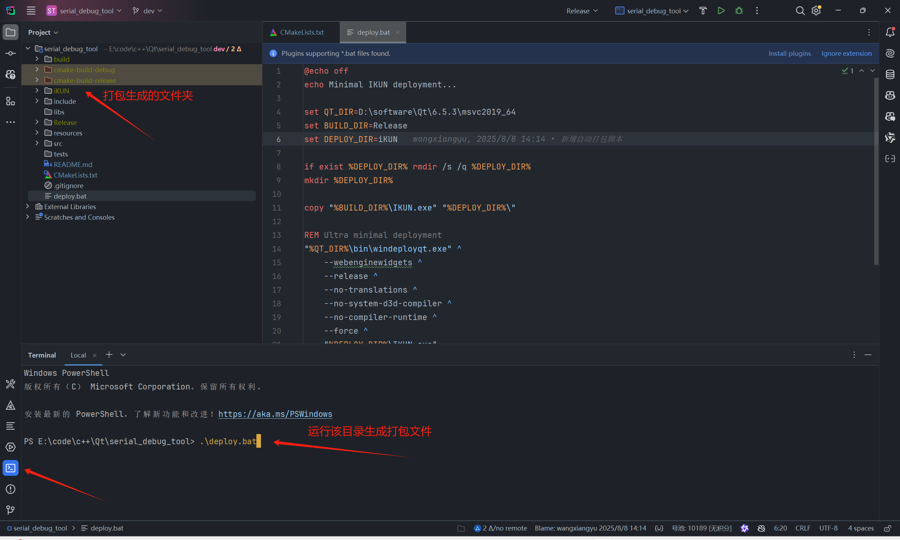
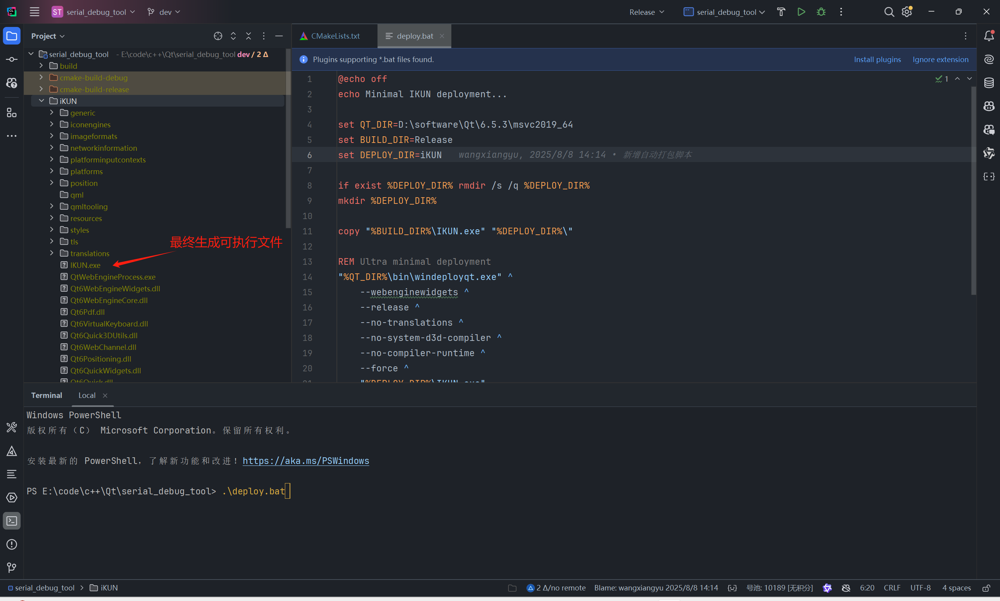
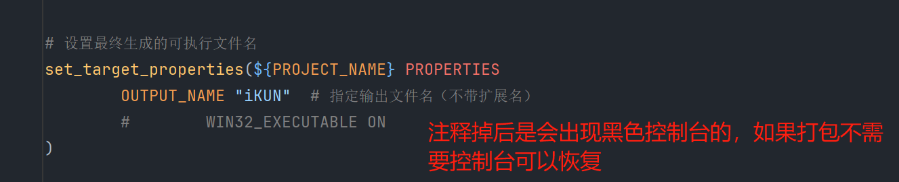

# IKUN 通信调试平台

一个基于 Qt6 和 C++20 构建的现代化、功能丰富的通信调试平台。该应用程序集成了**串口通信**、**TCP网络通信**、**Modbus RTU协议**、**JavaScript脚本引擎**、**数据可视化**等核心功能，为开发者提供了专业的数据处理和协议解析能力。支持多种数据格式、实时监控、专业级数据可视化和完全可定制的样式系统。集成了基于 ECharts 的波形显示功能，支持多通道数据管理和实时图表更新，内置强大的JavaScript脚本引擎支持自定义数据处理和复杂协议解析。

---

> 💡 **如果您觉得这个项目对您有帮助，请点击右上角的 ⭐ Star 支持一下，这是对我最大的鼓励！**
>
> ⚠️ **声明：本项目仅供学习研究使用，请勿用于商业用途。**

## 📖 使用说明

### 🔗 项目地址

演示地址
```
https://www.bilibili.com/video/BV1VcYTzrEJe
```

功能演示
```
https://www.bilibili.com/video/BV1kWJCzsEFT
```

Gitee

```
https://gitee.com/wangxiangyu123444/serial_debug_tool.git
```

GitHub

```
https://github.com/wangxiangyu2020/serial_debug_tool.git
```

阿里云盘

```
https://www.alipan.com/s/KZeBGaU3sbf
```

### 📋 自定义脚本示例

以下是四种典型的数据传输和解析场景，帮助您快速上手本工具的数据处理功能：

**说明**

在串口模块和TCP/IP模块自定义脚本使用是保持一致的。目前自定义脚本并不能支持很高的发送频率，最高只能支持1HZ（每秒），如果你需要很高的发送频率支持，只能使用默认的录波协议。

**默认录波协议说明**

当您不勾选"使用自定义脚本"选项时，软件将采用一套内置的默认协议来解析串口数据并进行录波。该协议格式简洁，易于在各种单片机（如STM32）上实现。

*协议格式*

默认协议是一种基于文本的键值对格式，其核心结构为：

```
ChannelID=Value
```

当您需要一次性发送多个通道的数据时，只需用**逗号（,）**将它们隔开即可。

```
ChannelID1=Value1,ChannelID2=Value2,ChannelID3=Value3,
```

*格式详解*

*ChannelID (通道标识符)*

- 等号 (=) 前面的部分。
- 它必须与您在软件通道管理器中设置的"通道标识符"完全一致。例如，如果您在软件中设置了一个通道，其标识符为 `ch1`，那么您单片机发送的ChannelID就必须是`ch1`。
- 前后的空格会被自动忽略。例如 `ch1 = 123,` 是有效的。

*Value (数值)*

- 等号 (=) 后面的部分。
- 它可以是整数或小数（例如 `100` 或 `-50.25`）。
- 程序会将其解析为双精度浮点数（double）。
- 前后的空格同样会被自动忽略。

*分隔符 (Separator)*

- 每个ChannelID=Value数据对之后，必须跟一个英文逗号 (,) 作为分隔符。
- 这个逗号非常重要，程序以此为依据来切分和确认一个完整的数据点。

*示例*

*发送单个数据点*
```
单片机发送：ch1=99.5,
```

*一次性发送多个数据点*
```
单片机发送：ch1=99.5,ch2=-50,ch1=99.8,
```

*包含空格的示例（同样有效）*
```
单片机发送：ch1 = 99.5 , ch2 = -50 ,
```

*STM32/C代码发送示例*

您可以在您的单片机项目中使用sprintf函数轻松地构建此格式的字符串。

```c
#include <stdio.h>
#include <string.h>

// 假设 data_buffer 是一个足够大的全局或静态 char 数组
// 假设 USART6_SendData 是您的串口发送函数

/**
  * @brief 发送符合默认录波协议的数据
  * @param channel_id_str: 通道标识符字符串 (e.g., "ch1")
  * @param value: 要发送的浮点数值
  * @retval None
  */
void Send_Default_Protocol_Data(const char* channel_id_str, float value)
{
    char data_buffer[50];
    
    // 使用 sprintf 格式化字符串，例如 "ch1=99.50,"
    int len = sprintf(data_buffer, "%s=%.2f,", channel_id_str, value);
    
    // 通过UART发送
    if (len > 0) {
        USART6_SendData((uint8_t*)data_buffer, len);
    }
}

// 调用示例：
// Send_Default_Protocol_Data("ch1", 99.5);
// Send_Default_Protocol_Data("ch2", -50.0);
```

*注意事项*

- **末尾的逗号**：请确保每条有效数据的末尾都有一个逗号，这有助于程序正确识别数据帧的结束。
- **数据流处理**：程序将串口数据视为连续的数据流。如果数据在逗号后还有剩余（例如 `ch1=100,ch2=5`），不完整的部分（`ch2=5`）会被缓存起来，等待下一个数据包的到来再进行拼接处理。

---

**场景一：自定义二进制协议（推荐）**

这是最灵活、最高效的方式，特别适合嵌入式系统。

- **适用场景**：需要高效、紧凑地传输二进制数据，且数据结构清晰。

*协议约定*

我们约定一个5字节长的数据帧格式：

| 字节位置   | 0      | 1      | 2         | 3         | 4      |
| ---------- | ------ | ------ | --------- | --------- | ------ |
| **含义**   | 帧头   | 通道ID | 数据高8位 | 数据低8位 | 帧尾   |
| **示例值** | `0xEB` | `0x01` | `0x00`    | `0xC8`    | `0xED` |

*STM32 发送端代码*

```c
void Send_Data(uint8_t channel_id, int16_t value)
{
    // 定义一个5字节的数组
    uint8_t data_frame[5];

    // 按照协议格式构建数据帧
    data_frame[0] = 0xEB; // 帧头
    data_frame[1] = channel_id; // 通道ID
    data_frame[2] = (uint8_t)(value >> 8);   // 数据高8位
    data_frame[3] = (uint8_t)(value & 0xFF); // 数据低8位
    data_frame[4] = 0xED; // 帧尾

    // 通过UART发送数据帧
	USART6_SendData(data_frame, 5);
}
```

*JavaScript 解析脚本*

```JavaScript
/**
 * 查找一个5字节的完整数据帧。
 */
function findFrame(buffer) {
    // 查找 0xEB ... 0xED 格式的5字节固定长度帧
    for (var i = 4; i < buffer.length; ++i) {
        if (buffer[i] === 0xED && buffer[i - 4] === 0xEB) {
            return i;
        }
    }
    return -1; // 没有找到完整帧
}

/**
 * 解析一个完整的数据帧。
 * @param {Array<number>} frame - 一个完整的数据帧缓冲区。
 * @param {object} context - 上下文对象。
 * @returns {object|null} - 返回一个包含解析数据的对象。
 */
function parseFrame(frame, context) {
    if (frame.length !== 5 || frame[0] !== 0xEB || frame[4] !== 0xED) {
        return null; // 格式不对，丢弃
    }

    // 第1步：识别通道ID
    var channelId = frame[1];

    // 第2步：提取数据
    var value = (frame[2] << 8) | frame[3];
    if (value & 0x8000) { value -= 0x10000; } // 符号转换

     // --- 在 displayText 前面加上来源信息 --- (可选)
     // var displayTextWithSource = "from " + context.source + ": " + value;
    
    // 第3步：根据通道ID返回不同的对象
    // channelId 需要与您在软件中添加通道时的“通道标识符”一致
    switch (channelId) {
        case 1:
            return {
                displayText: "channel1: " + value, // 用于显示文本
                chartData: { channelId: "ch1", point: value } // 用于绘制图表
            };
        case 2:
            return {
                displayText: "channel2: " + value,
                chartData: { channelId: "ch2", point: value }
            };
    }
}

/**
 * (核心函数) 批处理整个数据缓冲区。
 * @param {Array<number>} buffer - 从C++传入的整个原始数据缓冲区。
 * @param {object} context - 从C++传入的上下文对象，包含了额外信息。
 * 例如: { source: "192.168.1.100:12345" } { source: "COM1" }
 * @returns {object} - { bytesConsumed: number, frames: Array<object> }
 */
function processBuffer(buffer, context) {
    var results = [];
    var bytesConsumed = 0;
    while (bytesConsumed < buffer.length) {
        var remainingBuffer = buffer.slice(bytesConsumed);
        var frameEndPos = findFrame(remainingBuffer);
        if (frameEndPos < 0) { break; }
        var frameSize = frameEndPos + 1;
        var completeFrame = remainingBuffer.slice(0, frameSize);
        var parsedObject = parseFrame(completeFrame, context); 
        if (parsedObject) { results.push(parsedObject); }
        bytesConsumed += frameSize;
    }
    return { bytesConsumed: bytesConsumed, frames: results };
}
```

*关键点解析*

- **核心思想**：在 `parseFrame` 函数中使用 `switch (channelId)` 语句来区分不同的通道。
- **自定义**：您可以轻松地复制一个 `case` 模块，修改通道ID和 `displayText`，来适配您自己的协议。

------


**场景二：使用特定分隔符**

- **适用场景**：发送长度不固定的文本数据，例如GPS模块的NMEA语句或一些自定义的ASCII指令。

*协议约定*

- 数据格式为 `"ID=Value"`，例如 `"1=123.45"`。
- 每条数据都以一个**逗号** `,` 作为结束标志。

*STM32 发送端代码*

```c
void Send_Data(uint8_t channel_id, float value)
{
    char buffer[50];
    
    // 使用 sprintf 格式化字符串，例如 "1=25.50,"
    int len = sprintf(buffer, "%d=%.2f,", channel_id, value);
    
    // 通过UART发送
    if (len > 0) {
        USART6_SendData((uint8_t*)buffer, len);
    }
}
```


*JavaScript 解析脚本*

```JavaScript
/**
 * 查找分隔符 (逗号 ',' 的ASCII码是 44)。
 */
function findFrame(buffer) {
    for (var i = 0; i < buffer.length; ++i) {
        if (buffer[i] === 44) { // 查找逗号
            return i;
        }
    }
    return -1;
}

/**
 * 将字节数组转换为字符串，并按 "ID=Value" 格式解析。
 */
function parseFrame(frame, context) {
    // 将字节数组转换为字符串 (忽略最后的逗号)
    var frameAsString = "";
    for (var i = 0; i < frame.length - 1; ++i) {
        frameAsString += String.fromCharCode(frame[i]);
    }
    // --- 在 displayText 前面加上来源信息 --- (可选)
    // var displayTextWithSource = "from " + context.source + ": " + value;
    // 按等号分割
    var parts = frameAsString.split('=');
    if (parts.length === 2) {
        var channelId = parts[0];
        var value = parseFloat(parts[1]); // 解析数值

        if (!isNaN(value)) {
            return {
                displayText: "通道 " + channelId + " = " + value,
                chartData: { channelId: "ch" + channelId, point: value }
            };
        }
    }
    return null;
}

/**
 * 驱动函数 - 无需修改。
 */
function processBuffer(buffer,context) {
    // ... (此函数与上一个示例完全相同) ...
}
```

*关键点解析*

- **核心思想**：`findFrame` 的任务变成了寻找分隔符（这里是逗号）。`parseFrame` 则负责将收到的字节流先转换成字符串，再进行解析。


**场景三：使用固定长度**

- **适用场景**：协议非常简单，每个数据包的长度都完全一样，解析效率极高。

*协议约定*

- 所有数据帧的长度都是固定的 **8个字节**。
- **Byte 0**: 通道ID。
- **Byte 1-4**: 32位有符号整数值（大端模式）。
- **Byte 5-7**: 保留字节。

*STM32 发送端代码*

```c
void Send_Data(uint8_t channel_id, int32_t value)
{
    uint8_t data_frame[8];
    
    data_frame[0] = channel_id;
    data_frame[1] = (uint8_t)(value >> 24); // 数据高位
    data_frame[2] = (uint8_t)(value >> 16);
    data_frame[3] = (uint8_t)(value >> 8);
    data_frame[4] = (uint8_t)(value);      // 数据低位
    data_frame[5] = 0; // 保留字节
    data_frame[6] = 0;
    data_frame[7] = 0;
    
    USART6_SendData(data_frame, 8);
}
```


*JavaScript 解析脚本*

```JavaScript
const FRAME_LENGTH = 8; // 在脚本开头定义好固定长度

/**
 * 检查数据是否足够一个完整帧的长度。
 */
function findFrame(buffer) {
    if (buffer.length >= FRAME_LENGTH) {
        return FRAME_LENGTH - 1; // 返回第一个完整帧的结束索引
    }
    return -1;
}

/**
 * 按照固定的字节位置来解析数据。
 */
function parseFrame(frame, context) {
    if (frame.length === FRAME_LENGTH) {
        var channelId = frame[0];
        var value = (frame[1] << 24) | (frame[2] << 16) | (frame[3] << 8) | frame[4];
        
        return {
            displayText: "通道 " + channelId + " = " + value,
            chartData: { channelId: "ch" + channelId, point: value }
        };
    }
    return null;
}

/**
 * 驱动函数 - 无需修改。
 */
function processBuffer(buffer, context) {
    // ... (此函数与上一个示例完全相同) ...
}
```

*关键点解析*

- **核心思想**：`findFrame` 的逻辑变得极其简单，只检查长度。`parseFrame` 则像操作数组一样，直接从固定的索引（`frame[0]`, `frame[1]`...）中提取数据。

---

**编写脚本的重要注意事项**

为了确保您自定义的脚本能够被软件正确识别和执行，请务必遵循以下的数据结构约定。这些结构是软件与脚本之间交互的“契约”，任何改动都可能导致脚本无法正常工作。

*1. parseFrame 函数的返回结构*

`parseFrame` 函数负责解析单个数据帧，它返回的对象必须遵循以下固定结构。

```javascript
return {
    // displayText: [字符串],  // (可选) 用于在文本框中显示的字符串
    // chartData: {           // (可选) 用于绘制图表的对象
    //     channelId: [字符串], // (必选, 如果有chartData) 与软件中设置的通道标识符一致
    //     point: [数值]      // (必选, 如果有chartData) 用于绘图的数据点
    // }
};
```

*字段详解*：

**displayText (可选)**：
- 类型：字符串。
- 作用：定义了希望在软件的文本显示区看到的内容。如果您只需要绘图，可以省略此字段。

**chartData (可选)**：
- 类型：对象。
- 作用：定义了用于绘制图表的数据。如果您只需要显示文本，可以省略此字段。
- 但请注意：如果提供了 `chartData` 对象，那么它内部的 `channelId` 和 `point` 两个字段都必须存在。

**chartData.channelId (必选, 如果有chartData)**：
- 类型：字符串。
- 作用：告诉软件这个数据点属于哪个通道。这个值必须与您在软件通道管理器中设置的“通道标识符”完全一致（例如 "ch1", "ch2"）。

**chartData.point (必选, 如果有chartData)**：
- 类型：数值。
- 作用：图表上Y轴的实际数值。

**关键**: 以上所有键名 (displayText, chartData, channelId, point) 都是固定的，请勿修改，否则软件将无法识别。

*2. processBuffer 函数的返回结构*

`processBuffer` 是软件直接调用的核心入口函数，其返回结构绝对不能改变。

```javascript
return {
    bytesConsumed: [数值], // (必选) 本次调用成功处理的字节数
    frames: [数组]       // (必选) 由 parseFrame 返回的对象组成的数组
};
```

*字段详解*：

**bytesConsumed (必选)**：
- 类型：数值（整数）。
- 作用：告知软件本次函数调用处理了输入缓冲区中的多少个字节。软件会根据这个值来清理缓冲区，为下一次数据处理做准备。

**frames (必选)**：
- 类型：数组。
- 作用：一个数组，其中包含了本次调用中，所有被 `parseFrame` 成功解析出的数据对象。

**关键**: `bytesConsumed` 和 `frames` 这两个键名以及它们的数据类型是脚本与软件交互的唯一接口，任何改动都会导致整个脚本失效。

### 🔧 Modbus RTU 协议说明

**读取寄存器 (0x03) 流程**

```text
[ PC端 (主站 Master) ]         [ 物理层 (Serial Line) ]        [ 单片机 (从站 Slave) ]
         |                                |                                |
         | 1. 应用层决定读取数据              |                                |
         | (例如: 读取温度)                  |                                |
         |                                |                                |
         | 2. 通信层构建 [读] 请求帧          |                                |
         |    (包含功能码0x03, 地址, 数量, CRC) |                                |
         |                                |                                |
         | -- 发送请求帧 (01 03...) ------> |                                |
         |                                | --- 字节流传输 --->            |
         |                                |                                | --- 接收请求帧 ---> |
         |                                |                                | 6. 通信层接收数据   |
         |                                |                                |    - 检查地址匹配    |
         |                                |                                |    - 校验CRC      |
         |                                |                                |         |
         |                                |                                | 7. 应用层执行操作   |
         |                                |                                |    - 从内部存储区读取值|
         |                                |                                |         |
         |                                |                                | 8. 通信层构建 [响应] 帧|
         |                                |                                |    (包含数据和新CRC) |
         |                                |                                |         |
         |                                | <--- 字节流传输 ----           | <--- 发送响应帧 --- |
         |                                |                                |                     |
         | <--- 接收响应帧 ----------------- |                                |                     |
         | 9. 通信层接收数据                |                                |                     |
         |    - 校验CRC                    |                                |                     |
         |                                |                                |                     |
         | 10. 应用层获取解析后的数据       |                                |                     |
         |                                |                                |                     |
         | 11. 在UI界面上更新数值           |                                |                     |
         |                                |                                |                     |
         V                                V                                V
```

**写入寄存器 (0x06 / 0x10) 流程**

```text
[ PC端 (主站 Master) ]         [ 物理层 (Serial Line) ]        [ 单片机 (从站 Slave) ]
         |                                |                                |
         | 1. 应用层决定写入数据              |                                |
         | (例如: 设置目标温度为100)         |                                |
         |                                |                                |
         | 2. 通信层构建 [写] 请求帧          |                                |
         |    (包含功能码0x06/10, 地址, 值, CRC) |                               |
         |                                |                                |
         | -- 发送请求帧 (01 06...) ------> |                                |
         |                                | --- 字节流传输 --->            |
         |                                |                                | --- 接收请求帧 ---> |
         |                                |                                | 6. 通信层接收数据   |
         |                                |                                |    - 检查地址匹配    |
         |                                |                                |    - 校验CRC      |
         |                                |                                |         |
         |                                |                                | 7. 应用层执行操作   |
         |                                |                                |    - **修改**内部存储区的值|
         |                                |                                |         |
         |                                |                                | 8. 通信层构建 [确认] 帧|
         |                                |                                |    (不含数据,含新CRC)  |
         |                                |                                |         |
         |                                | <--- 字节流传输 ----           | <--- 发送确认帧 --- |
         |                                |                                |                     |
         | <--- 接收确认帧 ----------------- |                                |                     |
         | 9. 通信层接收数据                |                                |                     |
         |    - 校验CRC                    |                                |                     |
         |    - 确认操作是否成功             |                                |                     |
         |                                |                                |                     |
         | 10. 应用层获取“写入成功”状态     |                                |                     |
         |                                |                                |                     |
         | 11. 在UI日志区显示操作结果       |                                |                     |
         |                                |                                |                     |
         V                                V                                V
```

##### **读/写保持寄存器的Modbus RTU协议表**

**1. 读保持寄存器 (Function Code: 0x03)**

此功能用于从从站读取一个或多个连续的16位寄存器。

请求 (PC -> MCU)

**示例**: 从从站地址为`1`的设备，读取从`40011` (协议地址`0x000A`) 开始的`2`个寄存器。

| 字节 (Byte)                               | 字段                  | 长度 (Bytes) | 示例值 (HEX) | 说明                                    |
| ----------------------------------------- | --------------------- | ------------ | ------------ | --------------------------------------- |
| 0                                         | 从站地址              | 1            | `0x01`       | 目标从站的地址                          |
| 1                                         | 功能码                | 1            | `0x03`       | 固定为`0x03`                            |
| 2-3                                       | 起始地址 (高位在前)   | 2            | `0x000A`     | 寄存器的协议地址 (`40011 - 40001 = 10`) |
| 4-5                                       | 寄存器数量 (高位在前) | 2            | `0x0002`     | 要读取的寄存器个数                      |
| 6-7                                       | CRC校验 (低位在前)    | 2            | `0xE5CB`     | 对前面所有字节的CRC校验结果             |
| **完整请求帧**: `01 03 00 0A 00 02 E5 CB` |                       |              |              |                                         |

响应 (MCU -> PC)

**示例**: 成功响应上述请求，返回寄存器`40011`和`40012`的值，分别为`0x11AA`和`0x22BB`。

| 字节 (Byte)                                  | 字段               | 长度 (Bytes) | 示例值 (HEX) | 说明                                             |
| -------------------------------------------- | ------------------ | ------------ | ------------ | ------------------------------------------------ |
| 0                                            | 从站地址           | 1            | `0x01`       | 本从站的地址                                     |
| 1                                            | 功能码             | 1            | `0x03`       | 固定为`0x03`                                     |
| 2                                            | **数据字节数**     | 1            | `0x04`       | 后面数据部分的字节总数 (`2个寄存器 * 2字节 = 4`) |
| 3-4                                          | 第1个寄存器的值    | 2            | `0x11AA`     | `40011`地址的值                                  |
| 5-6                                          | 第2个寄存器的值    | 2            | `0x22BB`     | `40012`地址的值                                  |
| 7-8                                          | CRC校验 (低位在前) | 2            | `0x7E42`     | 对前面所有字节的CRC校验结果                      |
| **完整响应帧**: `01 03 04 11 AA 22 BB 7E 42` |                    |              |              |                                                  |

**2. 写单个寄存器 (Function Code: 0x06)**

此功能用于向从站的一个16位寄存器写入一个值。

请求 (PC -> MCU)

**示例**: 向从站地址为`1`的设备，在`40011` (协议地址`0x000A`) 写入值 `0x1234`。

| 字节 (Byte)                               | 字段                  | 长度 (Bytes) | 示例值 (HEX) | 说明                        |
| ----------------------------------------- | --------------------- | ------------ | ------------ | --------------------------- |
| 0                                         | 从站地址              | 1            | `0x01`       | 目标从站的地址              |
| 1                                         | 功能码                | 1            | `0x06`       | 固定为`0x06`                |
| 2-3                                       | 寄存器地址 (高位在前) | 2            | `0x000A`     | 要写入的寄存器协议地址      |
| 4-5                                       | 要写入的值 (高位在前) | 2            | `0x1234`     | 要写入的16位数据            |
| 6-7                                       | CRC校验 (低位在前)    | 2            | `0x29DF`     | 对前面所有字节的CRC校验结果 |
| **完整请求帧**: `01 06 00 0A 12 34 29 DF` |                       |              |              |                             |

响应 (MCU -> PC)

**说明**: 正常情况下，从站会返回一个与请求**完全相同**的确认帧。

**完整响应帧**: `01 06 00 0A 12 34 29 DF`

**3. 写多个寄存器 (Function Code: 0x10)**

此功能用于向从站**连续的多个**16位寄存器写入多个值。

请求 (PC -> MCU)

**示例**: 向从站地址为`1`的设备，从`40011` (协议地址`0x000A`) 开始，连续写入`2`个值：`0x11AA` 和 `0x22BB`。

| 字节 (Byte)                                              | 字段                  | 长度 (Bytes) | 示例值 (HEX) | 说明                                             |
| -------------------------------------------------------- | --------------------- | ------------ | ------------ | ------------------------------------------------ |
| 0                                                        | 从站地址              | 1            | `0x01`       | 目标从站的地址                                   |
| 1                                                        | 功能码                | 1            | `0x10`       | 固定为`0x10`                                     |
| 2-3                                                      | 起始地址 (高位在前)   | 2            | `0x000A`     | 要写入的起始寄存器协议地址                       |
| 4-5                                                      | 寄存器数量 (高位在前) | 2            | `0x0002`     | 要写入的寄存器个数                               |
| 6                                                        | **数据字节数**        | 1            | `0x04`       | 后面数据部分的字节总数 (`2个寄存器 * 2字节 = 4`) |
| 7-8                                                      | 第1个要写入的值       | 2            | `0x11AA`     | 写入地址`40011`的值                              |
| 9-10                                                     | 第2个要写入的值       | 2            | `0x22BB`     | 写入地址`40012`的值                              |
| 11-12                                                    | CRC校验 (低位在前)    | 2            | `0x91A4`     | 对前面所有字节的CRC校验结果                      |
| **完整请求帧**: `01 10 00 0A 00 02 04 11 AA 22 BB 91 A4` |                       |              |              |                                                  |

响应 (MCU -> PC)

**说明**: 正常情况下，从站会返回一个**简短的确认帧**，不包含写入的数据。

| 字节 (Byte)                               | 字段                  | 长度 (Bytes) | 示例值 (HEX) | 说明                        |
| ----------------------------------------- | --------------------- | ------------ | ------------ | --------------------------- |
| 0                                         | 从站地址              | 1            | `0x01`       | 本从站的地址                |
| 1                                         | 功能码                | 1            | `0x10`       | 固定为`0x10`                |
| 2-3                                       | 起始地址 (高位在前)   | 2            | `0x000A`     | 确认写入的起始地址          |
| 4-5                                       | 寄存器数量 (高位在前) | 2            | `0x0002`     | 确认写入的寄存器数量        |
| 6-7                                       | CRC校验 (低位在前)    | 2            | `0xA03D`     | 对前面所有字节的CRC校验结果 |
| **完整响应帧**: `01 10 00 0A 00 02 A0 3D` |                       |              |              |                             |

**4. 异常响应 (通用)**

当从站无法正确执行主站的请求时，会返回一个异常响应。

| 字节 (Byte)                      | 字段               | 长度 (Bytes) | 示例值 (HEX) | 说明                                              |
| -------------------------------- | ------------------ | ------------ | ------------ | ------------------------------------------------- |
| 0                                | 从站地址           | 1            | `0x01`       | 本从站的地址                                      |
| 1                                | **异常功能码**     | 1            | `0x83`       | 原始功能码的最高位置1 (`0x03` -> `0x83`)          |
| 2                                | **异常码**         | 1            | `0x02`       | 错误的具体原因代码 (`01`:非法功能, `02`:非法地址) |
| 3-4                              | CRC校验 (低位在前) | 2            | `0x30F1`     | 对前面3个字节的CRC校验                            |
| **完整异常帧**: `01 83 02 30 F1` |                    |              |              |                                                   |

##### MCU Modbus 协议响应代码示例

```c
#define MODBUS_SLAVE_ID         1    // 定义本设备的Modbus从站地址
#define HOLDING_REGISTERS_SIZE  50   // 模拟的保持寄存器的数量

// --- Modbus异常码 ---
#define EX_ILLEGAL_FUNCTION     0x01
#define EX_ILLEGAL_DATA_ADDRESS 0x02
#define EX_ILLEGAL_DATA_VALUE   0x03

// 使用静态数组模拟保持寄存器，并预设一些初始值
static uint16_t holding_registers[HOLDING_REGISTERS_SIZE] = {
    100, 200, 300, 400, 500, 600, 700, 800, 900, 1000, // 0-9
    0xAAAA, 0xBBBB, 0xCCCC, 0xDDDD, 0xEEEE, 0xFFFF   // 10-15
    // 其他寄存器默认为0
};

// 函数前向声明
static uint16_t calculate_crc16_fast(const volatile uint8_t *pdata, uint16_t length);
static void send_exception_response(uint8_t function_code, uint8_t exception_code);
static void handle_read_registers(const volatile uint8_t* request, uint16_t length);
static void handle_write_registers(const volatile uint8_t* request, uint16_t length);

// 【查表法CRC函数 - 修正版】
static const uint8_t crc_hi_table[]={0x00,0xC1,0x81,0x40,0x01,0xC0,0x80,0x41,0x01,0xC0,0x80,0x41,0x00,0xC1,0x81,0x40,0x01,0xC0,0x80,0x41,0x00,0xC1,0x81,0x40,0x00,0xC1,0x81,0x40,0x01,0xC0,0x80,0x41,0x01,0xC0,0x80,0x41,0x00,0xC1,0x81,0x40,0x00,0xC1,0x81,0x40,0x01,0xC0,0x80,0x41,0x00,0xC1,0x81,0x40,0x01,0xC0,0x80,0x41,0x01,0xC0,0x80,0x41,0x00,0xC1,0x81,0x40,0x01,0xC0,0x80,0x41,0x00,0xC1,0x81,0x40,0x00,0xC1,0x81,0x40,0x01,0xC0,0x80,0x41,0x00,0xC1,0x81,0x40,0x01,0xC0,0x80,0x41,0x01,0xC0,0x80,0x41,0x00,0xC1,0x81,0x40,0x00,0xC1,0x81,0x40,0x01,0xC0,0x80,0x41,0x01,0xC0,0x80,0x41,0x00,0xC1,0x81,0x40,0x01,0xC0,0x80,0x41,0x00,0xC1,0x81,0x40,0x00,0xC1,0x81,0x40,0x01,0xC0,0x80,0x41,0x01,0xC0,0x80,0x41,0x00,0xC1,0x81,0x40,0x00,0xC1,0x81,0x40,0x01,0xC0,0x80,0x41,0x00,0xC1,0x81,0x40,0x01,0xC0,0x80,0x41,0x01,0xC0,0x80,0x41,0x00,0xC1,0x81,0x40,0x00,0xC1,0x81,0x40,0x01,0xC0,0x80,0x41,0x01,0xC0,0x80,0x41,0x00,0xC1,0x81,0x40,0x01,0xC0,0x80,0x41,0x00,0xC1,0x81,0x40,0x00,0xC1,0x81,0x40,0x01,0xC0,0x80,0x41,0x00,0xC1,0x81,0x40,0x01,0xC0,0x80,0x41,0x01,0xC0,0x80,0x41,0x00,0xC1,0x81,0x40,0x01,0xC0,0x80,0x41,0x00,0xC1,0x81,0x40,0x00,0xC1,0x81,0x40,0x01,0xC0,0x80,0x41,0x01,0xC0,0x80,0x41,0x00,0xC1,0x81,0x40,0x00,0xC1,0x81,0x40,0x01,0xC0,0x80,0x41,0x00,0xC1,0x81,0x40,0x01,0xC0,0x80,0x41,0x01,0xC0,0x80,0x41,0x00,0xC1,0x81,0x40};
static const uint8_t crc_lo_table[]={0x00,0xC0,0xC1,0x01,0xC3,0x03,0x02,0xC2,0xC6,0x06,0x07,0xC7,0x05,0xC5,0xC4,0x04,0xCC,0x0C,0x0D,0xCD,0x0F,0xCF,0xCE,0x0E,0x0A,0xCA,0xCB,0x0B,0xC9,0x09,0x08,0xC8,0xD8,0x18,0x19,0xD9,0x1B,0xDB,0xDA,0x1A,0x1E,0xDE,0xDF,0x1F,0xDD,0x1D,0x1C,0xDC,0x14,0xD4,0xD5,0x15,0xD7,0x17,0x16,0xD6,0xD2,0x12,0x13,0xD3,0x11,0xD1,0xD0,0x10,0xF0,0x30,0x31,0xF1,0x33,0xF3,0xF2,0x32,0x36,0xF6,0xF7,0x37,0xF5,0x35,0x34,0xF4,0x3C,0xFC,0xFD,0x3D,0xFF,0x3F,0x3E,0xFE,0xFA,0x3A,0x3B,0xFB,0x39,0xF9,0xF8,0x38,0x28,0xE8,0xE9,0x29,0xEB,0x2B,0x2A,0xEA,0xEE,0x2E,0x2F,0xEF,0x2D,0xED,0xEC,0x2C,0xE4,0x24,0x25,0xE5,0x27,0xE7,0xE6,0x26,0x22,0xE2,0xE3,0x23,0xE1,0x21,0x20,0xE0,0xA0,0x60,0x61,0xA1,0x63,0xA3,0xA2,0x62,0x66,0xA6,0xA7,0x67,0xA5,0x65,0x64,0xA4,0x6C,0xAC,0xAD,0x6D,0xAF,0x6F,0x6E,0xAE,0xAA,0x6A,0x6B,0xAB,0x69,0xA9,0xA8,0x68,0x78,0xB8,0xB9,0x79,0xBB,0x7B,0x7A,0xBA,0xBE,0x7E,0x7F,0xBF,0x7D,0xBD,0xBC,0x7C,0xB4,0x74,0x75,0xB5,0x77,0xB7,0xB6,0x76,0x72,0xB2,0xB3,0x73,0xB1,0x71,0x70,0xB0,0x50,0x90,0x91,0x51,0x93,0x53,0x52,0x92,0x96,0x56,0x57,0x97,0x55,0x95,0x94,0x54,0x9C,0x5C,0x5D,0x9D,0x5F,0x9F,0x9E,0x5E,0x5A,0x9A,0x9B,0x5B,0x99,0x59,0x58,0x98,0x88,0x48,0x49,0x89,0x4B,0x8B,0x8A,0x4A,0x4E,0x8E,0x8F,0x4F,0x8D,0x4D,0x4C,0x8C,0x44,0x84,0x85,0x45,0x87,0x47,0x46,0x86,0x82,0x42,0x43,0x83,0x41,0x81,0x80,0x40};

static uint16_t calculate_crc16_fast(const volatile uint8_t *pdata, uint16_t length)
{
    uint8_t crc_hi=0xFF;uint8_t crc_lo=0xFF;uint8_t index;
    while(length--)
    {
        index=crc_lo^(*pdata++);crc_lo=crc_hi^crc_hi_table[index];crc_hi=crc_lo_table[index];
    }
    return((uint16_t)crc_hi<<8|crc_lo);
}


/**
 * @brief 发送Modbus异常响应
 * @param function_code 原始功能码
 * @param exception_code 异常码
 */
static void send_exception_response(uint8_t function_code, uint8_t exception_code)
{
    uint8_t response_frame[5];
    response_frame[0] = MODBUS_SLAVE_ID;
    response_frame[1] = function_code | 0x80; // 功能码最高位置1
    response_frame[2] = exception_code;

    uint16_t crc = calculate_crc16_fast(response_frame, 3);
    response_frame[3] = crc & 0xFF;
    response_frame[4] = (crc >> 8) & 0xFF;
    
    USART6_SendData(response_frame, 5);
}

/**
 * @brief 处理读寄存器请求 (FC=0x03)
 */
static void handle_read_registers(const volatile uint8_t* request, uint16_t length)
{
    uint16_t start_address = ((uint16_t)request[2] << 8) | request[3];
    uint16_t quantity = ((uint16_t)request[4] << 8) | request[5];

    // 地址范围校验
    if ((start_address + quantity) > HOLDING_REGISTERS_SIZE) {
        send_exception_response(0x03, EX_ILLEGAL_DATA_ADDRESS);
        return;
    }
    
    // 构建正常响应
    uint8_t response_frame[256]; // 响应帧最大长度
    uint8_t byte_count = quantity * 2;
    response_frame[0] = MODBUS_SLAVE_ID;
    response_frame[1] = 0x03;
    response_frame[2] = byte_count;
    
    // 从模拟寄存器数组中复制数据
    for (uint16_t i = 0; i < quantity; i++) {
        uint16_t reg_val = holding_registers[start_address + i];
        response_frame[3 + i * 2] = (reg_val >> 8) & 0xFF; // 高位
        response_frame[3 + i * 2 + 1] = reg_val & 0xFF;    // 低位
    }
    
    // 计算并添加CRC
    uint16_t response_len = 3 + byte_count;
    uint16_t crc = calculate_crc16_fast(response_frame, response_len);
    response_frame[response_len] = crc & 0xFF;
    response_frame[response_len + 1] = (crc >> 8) & 0xFF;
    
    USART6_SendData(response_frame, response_len + 2);
}

/**
 * @brief 处理写寄存器请求 (FC=0x06, 0x10)
 */
static void handle_write_registers(const volatile uint8_t* request, uint16_t length)
{
    uint8_t function_code = request[1];

    if (function_code == 0x06) // 写单个寄存器
    {
        uint16_t address = ((uint16_t)request[2] << 8) | request[3];
        uint16_t value = ((uint16_t)request[4] << 8) | request[5];

        if (address >= HOLDING_REGISTERS_SIZE) {
            send_exception_response(0x06, EX_ILLEGAL_DATA_ADDRESS);
            return;
        }
        
        // 写入数据
        holding_registers[address] = value;
        // 返回一个完全相同的确认帧
        USART6_SendData((uint8_t*)request, length);
    }
    else if (function_code == 0x10) // 写多个寄存器
    {
        uint16_t start_address = ((uint16_t)request[2] << 8) | request[3];
        uint16_t quantity = ((uint16_t)request[4] << 8) | request[5];
        uint8_t byte_count = request[6];
        
        // 校验字节数和地址范围
        if (byte_count != quantity * 2 || (start_address + quantity) > HOLDING_REGISTERS_SIZE) {
            send_exception_response(0x10, EX_ILLEGAL_DATA_ADDRESS);
            return;
        }

        // 写入数据
        for(int i = 0; i < quantity; ++i) {
            uint16_t value = ((uint16_t)request[7 + i*2] << 8) | request[8 + i*2];
            holding_registers[start_address + i] = value;
        }
        
        // 构建并发送确认帧 (比请求帧短)
        uint8_t response_frame[8];
        for(int i = 0; i < 6; ++i) response_frame[i] = request[i]; // 复制请求的前6个字节
        uint16_t crc = calculate_crc16_fast(response_frame, 6);
        response_frame[6] = crc & 0xFF;
        response_frame[7] = (crc >> 8) & 0xFF;
        USART6_SendData(response_frame, 8);
    }
}


/**
 * @brief Modbus RTU 核心处理函数 (调度中心)
 * @note  此函数应在主循环或RTOS任务中被周期性调用。
 */
void Modbus_RTU_Process(void)
{
    if (rx_frame_flag == 1)
    {
        uint16_t frame_len = rx_len;
        rx_frame_flag = 0;

        if (frame_len < 4) return; // 最小帧长校验 (地址1+功能码1+CRC2)

        uint16_t received_crc = (usart_buffer[frame_len - 1] << 8) | usart_buffer[frame_len - 2];
        uint16_t calculated_crc = calculate_crc16_fast(usart_buffer, frame_len - 2);

        if (received_crc == calculated_crc)
        {
            if (usart_buffer[0] == MODBUS_SLAVE_ID) // 是发给我的
            {
                uint8_t function_code = usart_buffer[1];
                
                switch (function_code)
                {
                    case 0x03: // 读
                        handle_read_registers(usart_buffer, frame_len);
                        break;
                        
                    case 0x06: // 写单个
                    case 0x10: // 写多个
                        handle_write_registers(usart_buffer, frame_len);
                        break;
                        
                    default: // 不支持的功能码
                        send_exception_response(function_code, EX_ILLEGAL_FUNCTION);
                        break;
                }
            }
        }
    }
}
```


## 🚀 本地部署

- 环境要求

  - CMake 3.30 或更高版本
  - Qt 6.5.3 或兼容版本
  - C++20 兼容编译器 (MSVC 2019+, GCC 10+, Clang 12+)
  - CLion开发与打包

- 编译配置

  

  

  

  

  

  

- 部署配置

  

  

  

  

  

- 运行说明

  

  运行时如果出现黑色控制台需要在CMakeList中恢复相关配置。（恢复的话用qDebug无法输出打印日志）

  

## 🌟 核心特性

### 💻 核心架构
- **数据包处理系统**: 新增 PacketProcessor 线程，专门处理串口和TCP数据流
- **JavaScript脚本引擎**: 内置 ScriptManager 管理器，支持自定义数据协议解析
- **统一网络管理**: TcpNetworkManager 支持客户端/服务器双模式
- **智能缓存管理**: 基于源地址的独立数据缓存系统
- **多线程异步处理**: 保证UI响应性和高并发数据处理能力

### 🖥️ 现代化界面
- **启动画面**: 专业的 SplashScreen 启动界面，提升用户体验
- **无边框窗口**: 自定义 FramelessBase 基类，支持窗口拖拽和边缘调整大小
- **自定义标题栏**: 集成最小化、最大化、关闭按钮的现代化标题栏
- **标签页界面**: 三个主要功能标签页（串口配置、波形显示、设置）
- **SVG 图标系统**: 18个可缩放的矢量图标，支持高DPI显示
- **自定义对话框**: 带动画效果的圆角对话框系统

### 📡 串口通信
- **完整串口管理**: 自动检测可用串口，支持所有标准串口参数配置
- **多种波特率**: 1200-115200 bps 全范围支持
- **数据位配置**: 5-8 数据位可选
- **校验位设置**: 无校验、奇校验、偶校验
- **停止位选择**: 1位、1.5位、2位停止位
- **流控制**: 无流控、硬件流控、软件流控
- **1MB 缓冲区**: 大容量串口读取缓冲，支持高速数据传输

### 🌐 TCP网络通信
- **TCP客户端模式**: 连接到远程TCP服务器，支持IP地址和端口配置
- **TCP服务器模式**: 作为服务器监听连接，支持多客户端同时连接
- **实时连接状态**: 显示连接状态和客户端信息
- **数据格式支持**: ASCII/HEX双格式显示和发送
- **时间戳和来源标识**: 自动标识数据来源和接收时间
- **定时发送**: 支持自定义间隔的定时数据发送
- **多客户端管理**: 服务器模式支持多个客户端同时连接和独立数据缓存
- **客户端选择发送**: 服务器模式支持向指定客户端发送数据或广播
- **连接状态监控**: 实时显示客户端连接数量和状态信息
- **网络异常处理**: 完整的网络错误处理和自动重连机制

### 🔧 Modbus RTU协议
- **完整的Modbus RTU实现**: 基于串口的标准Modbus RTU协议支持
- **多功能码支持**: 支持0x03(读保持寄存器)、0x06(写单个寄存器)、0x10(写多个寄存器)
- **智能点位管理**: 可视化的Modbus点位(标签)配置和管理系统
- **多数据类型支持**: UInt16、Int16、UInt32、Int32、Float32数据类型
- **字节序配置**: 支持大端(ABCD)、小端(DCBA)、字节交换(BADC/CDAB)四种字节序
- **数值换算**: 支持增益和偏移量配置，实现原始值到工程值的转换
- **轮询读取**: 自动轮询读取配置的点位数据，支持自定义轮询间隔
- **读写操作**: 支持单个和批量寄存器的读写操作
- **CRC校验**: 完整的CRC-16校验确保数据传输可靠性
- **异常处理**: 完善的Modbus异常响应处理和错误提示
- **请求优化**: 智能合并相邻寄存器读取请求，提高通信效率
- **实时数据显示**: 表格形式实时显示点位数据和状态
- **操作日志**: 详细的通信日志记录，便于调试和监控

### 📜 JavaScript脚本引擎
- **内置脚本引擎**: 基于QJSEngine的完整JavaScript运行环境
- **代码编辑器**: 内置JavaScript代码编辑器，支持语法高亮显示
- **主题切换**: 支持深色/浅色主题切换，优化编程体验
- **自定义协议解析**: 支持用户编写JavaScript脚本进行数据帧查找和解析
- **多模式支持**: 同时支持串口、TCP客户端、TCP服务器脚本
- **脚本管理**: ScriptManager单例管理器，支持脚本动态加载和缓存
- **实时编译检查**: 提供脚本语法验证和错误提示
- **内存管理**: 自动垃圾回收和缓存大小限制，防止内存泄漏
- **性能保护**: 限制最大迭代次数和处理时间，防止死循环
- **上下文支持**: 支持数据源信息传递，区分不同来源的数据
- **脚本状态控制**: 支持串口和TCP网络脚本的独立启用/禁用
- **默认脚本模板**: 提供完整的脚本模板和示例代码

### 📦 数据包处理系统
- **统一数据包**: DataPacket 封装，包含数据内容和源信息
- **异步处理**: 独立的 PacketProcessor 线程处理数据队列
- **单例模式**: PacketProcessor 采用单例模式，全局统一管理
- **智能路由**: 根据数据源自动选择串口或TCP处理逻辑
- **缓存管理**: 基于源地址的独立缓存，支持多客户端并发
- **高效同步**: 使用 QWaitCondition 实现生产者-消费者模式
- **内存优化**: swap 操作减少锁持有时间，提升性能
- **脚本集成**: 支持JavaScript脚本处理数据包
- **多源数据支持**: 支持串口和TCP多种数据源的统一处理
- **时间戳管理**: 内置通道时间戳管理，防止数据重复处理
- **线程安全**: 完整的多线程安全机制和数据保护

### 📊 数据处理与可视化
- **双格式显示**: ASCII 和 HEX 格式实时切换
- **时间戳功能**: 可选的毫秒级时间戳显示 [HH:mm:ss.zzz]
- **数据保存**: 实时数据保存到文件，支持文件选择和导出
- **数据清除**: 一键清除接收数据显示
- **自动滚动**: 可选的自动滚动到最新数据
- **专业波形显示**: 基于 ECharts 的实时数据波形显示
- **多通道支持**: 支持多个数据通道同时显示和管理
- **采样率配置**: 支持自定义采样率设置，优化数据采集性能
- **iKUN示波器**: 集成专业级示波器功能，支持数据点符号显示

### ⚡ 高级功能
- **定时发送**: 支持自定义间隔的定时数据发送
- **HEX 发送**: 十六进制格式数据发送
- **发送回显**: 可选的发送数据在接收区显示
- **多线程处理**: 异步数据读写，确保界面响应性
- **线程安全**: 使用互斥锁保护串口和网络操作
- **通道管理**: 单例模式的通道管理器，支持动态添加/删除通道
- **Web引擎集成**: QWebEngineView 集成 ECharts 实现专业级数据可视化
- **数据队列优化**: 支持大容量数据缓冲和批量处理 (60FPS刷新率)
- **资源清理**: 程序退出时自动清理 WebEngine 缓存
- **JavaScript脚本引擎**: 支持自定义JavaScript脚本进行数据处理和协议解析
- **实时帧同步**: 自动检测和解析数据帧，支持复杂协议处理
- **代码编辑器**: 内置高亮显示JavaScript代码编辑器，支持深色/浅色主题切换
- **数据包处理器**: 单独线程处理串口和TCP数据，支持高并发数据流
- **网络模式管理**: 支持空闲/客户端/服务器三种模式切换
- **智能缓存策略**: 按源地址分割的独立数据缓存管理

## 📁 项目结构

```
serial_debug_tool/
├── src/                    # 源代码 (42个文件)
│   ├── main.cpp           # 应用程序入口点 (包含SplashScreen集成)
│   ├── core/              # 核心业务逻辑 (5个文件)
│   │   ├── SerialPortManager.cpp          # 串口管理核心类
│   │   ├── ChannelManager.cpp             # 通道管理器 (单例模式)
│   │   ├── TcpNetworkManager.cpp          # TCP网络管理核心类
│   │   ├── ScriptManager.cpp              # JavaScript脚本管理器
│   │   └── ModbusController.cpp           # Modbus RTU协议控制器
│   ├── ui/                # 用户界面组件 (33个文件)
│   │   ├── MainWindow.cpp                 # 主窗口
│   │   ├── SplashScreen.cpp               # 启动画面
│   │   ├── TitleBar.cpp                   # 自定义标题栏
│   │   ├── CTabWidget.cpp                 # 标签页容器 (支持4个标签页)
│   │   ├── FramelessBase.cpp              # 无边框窗口基类
│   │   ├── CDialogBase.cpp                # 对话框基类 (带动画效果)
│   │   ├── CMessageBox.cpp                # 自定义消息框
│   │   ├── SerialPortConfigTab.cpp        # 串口配置标签页
│   │   ├── SerialPortConnectConfigWidget.cpp    # 串口连接配置
│   │   ├── SerialPortReceiveSettingsWidget.cpp  # 接收设置面板
│   │   ├── SerialPortSendSettingsWidget.cpp     # 发送设置面板
│   │   ├── SerialPortDataReceiveWidget.cpp      # 数据接收显示
│   │   ├── SerialPortDataSendWidget.cpp         # 数据发送输入
│   │   ├── SerialPortRealTimeSaveWidget.cpp     # 实时保存状态显示
│   │   ├── TcpNetworkConfigTab.cpp        # TCP网络配置标签页
│   │   ├── TcpNetworkClientWidget.cpp     # TCP客户端组件
│   │   ├── TcpNetworkServerWidget.cpp     # TCP服务器组件
│   │   ├── ModbusConfigTab.cpp            # Modbus配置标签页
│   │   ├── ModbusDisplayWidget.cpp        # Modbus主显示组件
│   │   ├── ModbusTagModel.cpp             # Modbus点位数据模型
│   │   ├── TagManagerDialog.cpp           # 点位管理对话框
│   │   ├── AddEditModbusTagDialog.cpp     # 点位编辑对话框
│   │   ├── WaveformTab.cpp                # 波形显示标签页
│   │   ├── WaveformWidget.cpp             # ECharts 波形显示组件
│   │   ├── WaveformCtrlWidget.cpp         # 波形控制面板
│   │   ├── AddChannelDialog.cpp           # 添加通道对话框
│   │   ├── RemoveChannelDialog.cpp        # 移除通道对话框
│   │   ├── SampleRateDialog.cpp           # 采样率配置对话框
│   │   ├── ScriptEditorDialog.cpp         # JavaScript脚本编辑对话框
│   │   └── SettingsTab.cpp                # 设置标签页
│   └── utils/             # 工具类 (7个文件)
│       ├── StyleLoader.cpp               # QSS样式加载器
│       ├── ThreadPoolManager.cpp         # 线程池管理器
│       ├── SerialPortSettings.cpp        # 串口参数配置工具
│       ├── PacketProcessor.cpp           # 数据包处理器
│       ├── JavaScriptHighlighter.cpp     # JavaScript代码高亮器
│       └── ModbusUtils.cpp               # Modbus工具函数库
├── include/               # 头文件 (与src结构对应，42个文件)
│   ├── core/              # 核心模块头文件 (5个文件)
│   │   ├── SerialPortManager.h, ChannelManager.h
│   │   ├── TcpNetworkManager.h            # TCP网络管理器
│   │   ├── ScriptManager.h                # JavaScript脚本管理器
│   │   └── ModbusController.h             # Modbus RTU协议控制器
│   ├── ui/                # UI组件头文件 (33个文件)
│   │   ├── MainWindow.h, SplashScreen.h, TitleBar.h, CTabWidget.h
│   │   ├── FramelessBase.h, CDialogBase.h, CMessageBox.h
│   │   ├── SerialPortConfigTab.h, SerialPortConnectConfigWidget.h
│   │   ├── SerialPortReceiveSettingsWidget.h, SerialPortSendSettingsWidget.h
│   │   ├── SerialPortDataReceiveWidget.h, SerialPortDataSendWidget.h
│   │   ├── SerialPortRealTimeSaveWidget.h
│   │   ├── TcpNetworkConfigTab.h, TcpNetworkClientWidget.h, TcpNetworkServerWidget.h
│   │   ├── ModbusConfigTab.h, ModbusDisplayWidget.h, ModbusTagModel.h
│   │   ├── TagManagerDialog.h, AddEditModbusTagDialog.h
│   │   ├── WaveformTab.h, WaveformWidget.h, WaveformCtrlWidget.h
│   │   ├── AddChannelDialog.h, RemoveChannelDialog.h, SampleRateDialog.h
│   │   ├── ScriptEditorDialog.h           # JavaScript脚本编辑对话框
│   │   └── SettingsTab.h
│   └── utils/             # 工具类头文件 (10个文件)
│       ├── StyleLoader.h, ThreadPoolManager.h, SerialPortSettings.h
│       ├── PacketProcessor.h, DataPacket.h, ThreadSetup.h
│       ├── JavaScriptHighlighter.h, NetworkModeState.h
│       ├── ModbusTag.h, ModbusUtils.h
└── resources/             # 应用程序资源
│   ├── icons/            # SVG 和 ICO 图标文件 (22个图标)
│   │   ├── 界面图标: logo.svg, serial.svg, waves.svg, settings.svg, tcp_network.svg
│   │   ├── 操作图标: send.svg, checkmark_blue.svg, down_arrow.svg
│   │   ├── 波形图标: add_series.svg, remove_series.svg, clear_series.svg
│   │   ├── 数据图标: import_series.svg, export_series.svg
│   │   ├── 控制图标: start_series.svg, stop_series.svg, sample_rate.svg
│   │   ├── 功能图标: code.svg (脚本编辑), help.svg (帮助)
│   │   └── 应用图标: ikun.ico, ikun.svg, silder_ikun.svg, un_dev.svg
│   ├── qss/              # Qt 样式表文件 (21个样式文件)
│   │   ├── 主界面: main_window.qss, title_bar.qss, tab_bar.qss
│   │   ├── 对话框: dialog_base.qss, add_channel_dialog.qss, remove_channel_dialog.qss, sample_rate_dialog.qss
│   │   ├── 脚本编辑: script_editor_dialog.qss
│   │   ├── 波形界面: wave_form_tab.qss, wave_form_ctrl_widget.qss
│   │   ├── TCP网络: tcp_network_config_tab.qss, tcp_network_client_wdiget.qss, tcp_network_server_wdiget.qss
│   │   ├── 串口组件: serial_prot_config_tab.qss
│   │   ├── 串口配置: serial_port_connect_config_widget.qss
│   │   ├── 串口设置: serial_port_receive_settings_widget.qss, serial_port_send_settings_widget.qss
│   │   ├── 串口数据: serial_port_data_receive_widget.qss, serial_port_data_send_widget.qss
│   │   ├── 实时保存: serial_port_real_time_save_widget.qss
│   │   └── 设置页面: settings_tab.qss
│   ├── web/              # Web资源 (ECharts集成，2个文件)
│   │   ├── echarts.min.js                 # ECharts库文件 (压缩版)
│   │   └── wave.html                      # 波形显示HTML页面
│   └── version.rc        # Windows 版本资源
├── cmake-build-debug/     # 调试版本构建输出
├── cmake-build-release/   # 发布版本构建输出
├── Release/              # 最终发布二进制文件 (iKUN.exe)
├── tests/                # 单元测试目录 (待实现)
├── libs/                 # 外部库目录
├── deploy.bat            # Windows 部署脚本
└── CMakeLists.txt        # CMake 构建配置
```

## 🏗️ 系统架构

### 项目模块组成图

> **说明**: 此项目模块组成图以文本形式展示了完整的5层架构设计，包括应用层、UI层、核心层、数据处理层、工具层和资源系统的模块组成与层级关系

```
═══════════════════════════════════════════════════════════════

应用层 (Application Layer):
┌─────────────────────────────────────────────────────────────┐
│                     应用程序入口                          │
├─────────────────────────────────────────────────────────────┤
│  ┌─────────────┐    ┌─────────────────┐                   │
│  │  main.cpp   │───→│   MainWindow    │                   │
│  │  应用程序启动 │    │   主窗口管理     │                   │
│  └─────────────┘    └─────────────────┘                   │
│           ▲                   │                           │
│           │                   ▼                           │
│  ┌─────────────┐    ┌─────────────────┐                   │
│  │SplashScreen │    │  FramelessBase  │                   │
│  │   启动画面   │    │  无边框窗口基类  │                   │
│  └─────────────┘    └─────────────────┘                   │
│                              │                           │
│                              ▼                           │
│                    ┌─────────────────┐                   │
│                    │    TitleBar     │                   │
│                    │   自定义标题栏   │                   │
│                    └─────────────────┘                   │
└─────────────────────────────────────────────────────────────┘
                              ▼
═══════════════════════════════════════════════════════════════

UI层 (User Interface Layer):
┌─────────────────────────────────────────────────────────────┐
│                     标签页容器系统                         │
├─────────────────────────────────────────────────────────────┤
│  ┌─────────────────┐    ┌─────────────────┐               │
│  │   CTabWidget    │───→│   4个功能标签    │               │
│  │   标签页容器     │    │串口|TCP|波形|设置│               │
│  └─────────────────┘    └─────────────────┘               │
└─────────────────────────────────────────────────────────────┘
                              │
┌─────────────────────────────────────────────────────────────┐
│                   串口功能组件模块                          │
├─────────────────────────────────────────────────────────────┤
│  ┌───────────────────┐  ┌─────────────────────────────────┐ │
│  │SerialPortConfigTab│  │         串口子组件群            │ │
│  │  串口配置主标签页  │─→│ ┌─────────────────────────────┐ │ │
│  └───────────────────┘  │ │SerialPortConnectConfigWidget│ │ │
│                         │ │       连接配置组件           │ │ │
│                         │ ├─────────────────────────────┤ │ │
│                         │ │SerialPortReceiveSettingsWidget │ │
│                         │ │       接收设置组件           │ │ │
│                         │ ├─────────────────────────────┤ │ │
│                         │ │SerialPortSendSettingsWidget │ │ │
│                         │ │       发送设置组件           │ │ │
│                         │ ├─────────────────────────────┤ │ │
│                         │ │SerialPortDataReceiveWidget  │ │ │
│                         │ │       数据接收显示           │ │ │
│                         │ ├─────────────────────────────┤ │ │
│                         │ │SerialPortDataSendWidget     │ │ │
│                         │ │       数据发送输入           │ │ │
│                         │ ├─────────────────────────────┤ │ │
│                         │ │SerialPortRealTimeSaveWidget │ │ │
│                         │ │       实时保存状态           │ │ │
│                         │ └─────────────────────────────┘ │ │
│                         └─────────────────────────────────┘ │
└─────────────────────────────────────────────────────────────┘

┌─────────────────────────────────────────────────────────────┐
│                  TCP网络功能组件模块                        │
├─────────────────────────────────────────────────────────────┤
│  ┌───────────────────┐  ┌─────────────────────────────────┐ │
│  │TcpNetworkConfigTab│  │        TCP网络子组件群          │ │
│  │ TCP网络配置标签页 │─→│ ┌─────────────────────────────┐ │ │
│  └───────────────────┘  │ │  TcpNetworkClientWidget     │ │ │
│                         │ │      TCP客户端组件          │ │ │
│                         │ │   IP地址、端口、HEX/ASCII   │ │ │
│                         │ │   定时发送、JS脚本支持      │ │ │
│                         │ ├─────────────────────────────┤ │ │
│                         │ │  TcpNetworkServerWidget     │ │ │
│                         │ │      TCP服务器组件          │ │ │
│                         │ │   监听端口、多客户端管理     │ │ │
│                         │ │   广播模式、JS脚本支持      │ │ │
│                         │ └─────────────────────────────┘ │ │
│                         └─────────────────────────────────┘ │
└─────────────────────────────────────────────────────────────┘

┌─────────────────────────────────────────────────────────────┐
│                 Modbus RTU功能组件模块                      │
├─────────────────────────────────────────────────────────────┤
│  ┌───────────────────┐  ┌─────────────────────────────────┐ │
│  │ ModbusConfigTab   │  │       Modbus RTU子组件群        │ │
│  │Modbus配置标签页   │─→│ ┌─────────────────────────────┐ │ │
│  └───────────────────┘  │ │   ModbusDisplayWidget       │ │ │
│                         │ │     Modbus主显示组件        │ │ │
│                         │ │  读写操作控制、轮询配置      │ │ │
│                         │ │  实时数据表格、通信日志      │ │ │
│                         │ ├─────────────────────────────┤ │ │
│                         │ │    TagManagerDialog         │ │ │
│                         │ │     点位管理对话框          │ │ │
│                         │ │  可视化点位配置和管理        │ │ │
│                         │ ├─────────────────────────────┤ │ │
│                         │ │  AddEditModbusTagDialog     │ │ │
│                         │ │     点位编辑对话框          │ │ │
│                         │ │  详细参数配置、数据类型      │ │ │
│                         │ │  字节序、增益偏移量设置      │ │ │
│                         │ ├─────────────────────────────┤ │ │
│                         │ │     ModbusTagModel          │ │ │
│                         │ │     点位数据模型            │ │ │
│                         │ │  表格数据绑定、实时更新      │ │ │
│                         │ └─────────────────────────────┘ │ │
│                         └─────────────────────────────────┘ │
└─────────────────────────────────────────────────────────────┘

┌─────────────────────────────────────────────────────────────┐
│                   波形可视化组件模块                        │
├─────────────────────────────────────────────────────────────┤
│  ┌─────────────────┐  ┌─────────────────────────────────────┐ │
│  │   WaveformTab   │  │         波形子组件群              │ │
│  │  波形显示标签页 │─→│ ┌─────────────────────────────────┐ │ │
│  └─────────────────┘  │ │      WaveformWidget             │ │ │
│                       │ │    ECharts波形显示组件          │ │ │
│                       │ │ ┌─────────────────────────────┐ │ │ │
│                       │ │ │   基于QWebEngineView       │ │ │ │
│                       │ │ │   支持多通道数据同时显示     │ │ │ │
│                       │ │ │   实时数据更新和图表刷新     │ │ │ │
│                       │ │ │   JavaScript与C++交互       │ │ │ │
│                       │ │ └─────────────────────────────┘ │ │ │
│                       │ ├─────────────────────────────────┤ │ │
│                       │ │    WaveformCtrlWidget           │ │ │
│                       │ │      波形控制面板               │ │ │
│                       │ │ ┌─────────────────────────────┐ │ │ │
│                       │ │ │ 6个功能按钮：添加|移除|清除  │ │ │ │
│                       │ │ │ 导入|导出|开始/停止         │ │ │ │
│                       │ │ │ 集成通道管理功能            │ │ │ │
│                       │ │ └─────────────────────────────┘ │ │ │
│                       │ └─────────────────────────────────┘ │ │
│                       └─────────────────────────────────────┘ │
└─────────────────────────────────────────────────────────────┘

┌─────────────────────────────────────────────────────────────┐
│                    对话框系统模块                          │
├─────────────────────────────────────────────────────────────┤
│  ┌─────────────────┐  ┌─────────────────────────────────────┐ │
│  │  CDialogBase    │  │         专用对话框群              │ │
│  │  对话框基类     │─→│ ┌─────────────────────────────────┐ │ │
│  │ ┌─────────────┐ │  │ │     AddChannelDialog            │ │ │
│  │ │无边框圆角设计│ │  │ │      添加通道对话框             │ │ │
│  │ │淡入动画效果 │ │  │ ├─────────────────────────────────┤ │ │
│  │ │确定取消按钮 │ │  │ │    RemoveChannelDialog          │ │ │
│  │ └─────────────┘ │  │ │      移除通道对话框             │ │ │
│  └─────────────────┘  │ ├─────────────────────────────────┤ │ │
│                       │ │     SampleRateDialog            │ │ │
│                       │ │      采样率配置对话框           │ │ │
│                       │ ├─────────────────────────────────┤ │ │
│                       │ │    ScriptEditorDialog           │ │ │
│                       │ │     JavaScript脚本编辑器        │ │ │
│                       │ ├─────────────────────────────────┤ │ │
│                       │ │      CMessageBox                │ │ │
│                       │ │     自定义消息提示框            │ │ │
│                       │ └─────────────────────────────────┘ │ │
│                       └─────────────────────────────────────┘ │
└─────────────────────────────────────────────────────────────┘

┌─────────────────────────────────────────────────────────────┐
│                    其他UI组件模块                          │
├─────────────────────────────────────────────────────────────┤
│  ┌─────────────────┐                                        │
│  │   SettingsTab   │ ← 设置标签页 (基础框架)                │
│  │   设置标签页    │                                        │
│  └─────────────────┘                                        │
└─────────────────────────────────────────────────────────────┘
                              ▼
═══════════════════════════════════════════════════════════════

核心层 (Core Layer):
┌─────────────────────────────────────────────────────────────┐
│                     核心业务逻辑管理器                      │
├─────────────────────────────────────────────────────────────┤
│  ┌─────────────────┐  ┌─────────────────┐                   │
│  │SerialPortManager│  │TcpNetworkManager│                   │
│  │  串口通信管理器  │  │ TCP网络管理器   │                   │
│  │ ┌─────────────┐ │  │ ┌─────────────┐ │                   │
│  │ │基于QSerialPort││  │ │单例模式设计  │ │                   │
│  │ │线程安全操作 │ │  │ │客户端服务器  │ │                   │
│  │ │原子操作标志 │ │  │ │双模式支持   │ │                   │
│  │ │HEX/ASCII转换│ │  │ │QTcpSocket   │ │                   │
│  │ │时间戳生成   │ │  │ │QTcpServer   │ │                   │
│  │ │1MB读取缓冲  │ │  │ │多客户端管理 │ │                   │
│  │ │异步读写处理 │ │  │ │定时发送功能 │ │                   │
│  │ │错误处理机制 │ │  │ │网络异常处理 │ │                   │
│  │ └─────────────┘ │  │ └─────────────┘ │                   │
│  └─────────────────┘  └─────────────────┘                   │
│                                                             │
│  ┌─────────────────┐  ┌─────────────────┐                   │
│  │ ChannelManager  │  │  ScriptManager  │                   │
│  │   通道管理器    │  │ 脚本引擎管理器   │                   │
│  │ ┌─────────────┐ │  │ ┌─────────────┐ │                   │
│  │ │单例模式设计  │ │  │ │单例模式设计  │ │                   │
│  │ │线程安全管理  │ │  │ │基于QJSEngine │ │                   │
│  │ │通道信息存储  │ │  │ │完整JS运行环境│ │                   │
│  │ │信号槽通知   │ │  │ │串口TCP脚本   │ │                   │
│  │ │增删改查操作  │ │  │ │动态编译缓存  │ │                   │
│  │ │ChannelInfo  │ │  │ │内存管理     │ │                   │
│  │ │结构体支持   │ │  │ │性能保护     │ │                   │
│  │ └─────────────┘ │  │ │异常捕获     │ │                   │
│  └─────────────────┘  │ └─────────────┘ │                   │
│                       └─────────────────┘                   │
│                                                             │
│  ┌─────────────────┐                                        │
│  │ModbusController │ ← Modbus RTU协议控制器                 │
│  │Modbus协议管理器 │                                        │
│  │ ┌─────────────┐ │                                        │
│  │ │单例模式设计  │ │                                        │
│  │ │完整RTU协议栈 │ │                                        │
│  │ │多功能码支持  │ │                                        │
│  │ │0x03读保持寄存器│                                        │
│  │ │0x06写单个寄存器│                                        │
│  │ │0x10写多个寄存器│                                        │
│  │ │CRC-16校验   │ │                                        │
│  │ │响应超时检测  │ │                                        │
│  │ │异常处理机制  │ │                                        │
│  │ │串口通信集成  │ │                                        │
│  │ └─────────────┘ │                                        │
│  └─────────────────┘                                        │
└─────────────────────────────────────────────────────────────┘
                              ▼
═══════════════════════════════════════════════════════════════

数据处理层 (Data Processing Layer):
┌─────────────────────────────────────────────────────────────┐
│  ┌─────────────────┐  ┌─────────────────┐                   │
│  │ PacketProcessor │  │   DataPacket    │ ← 统一数据包处理  │
│  │  数据包处理器   │─→│   数据包结构     │                   │
│  │ 单例独立线程    │  │ 源信息标识        │  (串口/TCP)       │
│  │ 智能路由分发    │  │ 轻量级设计        │                   │
│  │ JS脚本/默认协议   │  │ 高频传输适配      │  ┌─────────────────┐ │
│  │ 分源缓存管理    │  └─────────────────┘  │   ThreadSetup   │ │
│  │ 生产消费模式    │                       │   线程设置工具   │ │
│  │ 线程安全队列    │                       │ 模板化线程初始  │ │
│  └─────────────────┘                       └─────────────────┘ │
└─────────────────────────────────────────────────────────────┘
                              ▼
═══════════════════════════════════════════════════════════════

工具层 (Utils Layer):
┌─────────────────────────────────────────────────────────────┐
│  ┌─────────────────┐  ┌─────────────────┐                   │
│  │   StyleLoader   │  │ThreadPoolManager│ ← 通用工具类       │
│  │  样式表加载器   │  │  线程池管理器   │                   │
│  │ 资源文件加载    │  │ Qt Concurrent框架  │                   │
│  │ 运行时更新      │  │ 任意函数支持      │                   │
│  │ 颜色转换工具    │  │ 安全关闭机制      │                   │
│  └─────────────────┘  └─────────────────┘                   │
│                                                             │
│  ┌─────────────────┐  ┌─────────────────┐                   │
│  │SerialPortSettings│ │JavaScriptHighlighter│                │
│  │  串口参数工具   │  │ JS语法高亮器    │                   │
│  │ 标准参数选项    │  │ QSyntaxHighlighter │                   │
│  │ ComboBox配置     │  │ 关键字注释高亮     │                   │
│  │ 默认值设置       │  │ 深浅色主题切换     │                   │
│  └─────────────────┘  └─────────────────┘                   │
│                                                             │
│  ┌─────────────────┐                                        │
│  │NetworkModeState │ ← TCP模式状态管理                      │
│  │ 网络模式状态    │   时间戳、HEX显示、发送状态         │
│  │ 客户端服务器    │   在模式间共享状态              │
│  └─────────────────┘                                        │
│                                                             │
│  ┌─────────────────┐  ┌─────────────────┐                   │
│  │   ModbusTag     │  │  ModbusUtils    │ ← Modbus工具类     │
│  │ Modbus点位结构  │  │ Modbus工具函数  │                   │
│  │ 完整点位配置信息 │  │ 32位数据重组   │                   │
│  │ 多种数据类型    │  │ 字节序转换     │                   │
│  │ 四种字节序配置  │  │ 类型转换工具   │                   │
│  │ 增益偏移量换算  │  │ 浮点数解释     │                   │
│  │ 实时原始数据    │  │ 位操作工具     │                   │
│  │ Qt元类型集成   │  └─────────────────┘                   │
│  └─────────────────┘                                        │
└─────────────────────────────────────────────────────────────┘
                              ▼
═══════════════════════════════════════════════════════════════

资源系统 (Resources):
┌─────────────────────────────────────────────────────────────┐
│  ┌─────────────────┐  ┌─────────────────┐                   │
│  │    图标系统     │  │    样式系统     │                   │
│  │ 23个SVG/ICO图标 │  │ 21个QSS样式表   │                   │
│  │ 界面图标5个     │  │ 主界面样式3个 │                   │
│  │ 操作图标3个     │  │ 对话框样式4个 │                   │
│  │ 波形图标6个     │  │ 波形界面2个  │                   │
│  │ 数据图标2个     │  │ TCP网络3个   │                   │
│  │ 控制图标3个     │  │ 串口组件8个  │                   │
│  │ 功能图标2个     │  │ 设置页面1个  │                   │
│  │ 应用图标4个     │  │ 支持主题定制    │                   │
│  │ 矢量高DPI支持 │  └─────────────────┘                   │
│  └─────────────────┘                                        │
│                                                             │
│  ┌─────────────────┐  ┌─────────────────┐                   │
│  │   Web资源       │  │   版本资源       │                   │
│  │  ECharts集成    │  │ Windows资源文件 │                   │
│  │ wave.html页面   │  │ version.rc配置  │                   │
│  │ echarts.min.js  │  │ 应用程序信息    │                   │
│  │ 专业数据可视化  │  │ 图标版本号      │                   │
│  └─────────────────┘  └─────────────────┘                   │
│                                                             │
│  ┌─────────────────┐                                        │
│  │   部署脚本      │ ← Windows一键部署                      │
│  │  deploy.bat     │   Qt DLL、插件、资源                   │
│  │ 自动化部署      │   最小化部署支持                        │
│  └─────────────────┘                                        │
└─────────────────────────────────────────────────────────────┘
```

### 数据流架构图

> **说明**: 此数据流架构图以文本形式展示了用户操作从启动到数据收发的完整流程，包括串口、TCP网络通信、JavaScript脚本处理和波形可视化的详细数据流向

#### **用户操作数据流程图**

```
═══════════════════════════════════════════════════════════════

启动阶段:
┌─────────────┐    ┌──────────────┐    ┌─────────────────┐
│    用户     │───→│  main.cpp   │───→│  SplashScreen  │
│  启动应用   │    │   应用启动   │    │    启动画面     │
└─────────────┘    └──────────────┘    └─────────────────┘
                          │
                          ▼
┌─────────────────┐    ┌──────────────┐    ┌─────────────────┐
│  MainWindow    │───→│ CTabWidget  │───→│   4个功能标签   │
│   主窗口管理    │    │   标签容器   │    │ 串口|TCP|波形|设置│
└─────────────────┘    └──────────────┘    └─────────────────┘
                          │
                          ▼
┌─────────────────┐    ┌──────────────┐
│ PacketProcessor │←───│ 线程启动管理  │
│  数据包处理器   │    │   初始化     │
└─────────────────┘    └──────────────┘

═══════════════════════════════════════════════════════════════

串口通信数据流:
┌─────────────┐    ┌────────────────────┐    ┌─────────────────┐
│    用户     │───→│SerialPortConfigTab│───→│SerialPortManager│
│  配置串口   │    │   串口配置界面     │    │   串口管理器    │
└─────────────┘    └────────────────────┘    └─────────────────┘
                                                     │
                          ┌─────────────────────────┘
                          ▼
┌─────────────┐    ┌──────────────┐    ┌─────────────────┐
│ QSerialPort │───→│ DataPacket  │───→│ PacketProcessor │
│   Qt串口    │    │   数据包     │    │  数据包处理器   │
└─────────────┘    └──────────────┘    └─────────────────┘
                                                     │
        ┌────────────────────────────────────────────┘
        ▼                    ▼                    ▼
┌──────────────┐    ┌──────────────┐    ┌──────────────┐
│   UI显示     │    │ 脚本处理     │    │  波形更新    │
│SerialPortTab │    │ScriptManager │    │ChannelManager│
└──────────────┘    └──────────────┘    └──────────────┘

═══════════════════════════════════════════════════════════════

TCP网络通信数据流:
┌─────────────┐    ┌─────────────────────┐    ┌─────────────────┐
│    用户     │───→│ TcpNetworkConfigTab │───→│TcpNetworkManager│
│  配置TCP   │    │   TCP配置界面       │    │  TCP管理器      │
└─────────────┘    └─────────────────────┘    └─────────────────┘
                                                      │
                     ┌────────────────────────────────┘
                     ▼                    ▼
            ┌──────────────┐    ┌──────────────┐
            │ QTcpSocket  │    │ QTcpServer  │
            │ TCP客户端   │    │ TCP服务器   │
            └──────────────┘    └──────────────┘
                     │                    │
                     └────────────────────┘
                              ▼
            ┌─────────────────────────────────────┐
            │          DataPacket               │
            │      (source: IP:Port)           │
            └─────────────────────────────────────┘
                              ▼
            ┌─────────────────────────────────────┐
            │       PacketProcessor             │
            │    (智能路由处理)                  │
            │  ┌─────────────┐ ┌─────────────┐   │
            │  │ TCP数据缓存 │ │ 脚本处理   │   │
            │  │(按源分割)   │ │ 或默认协议  │   │
            │  └─────────────┘ └─────────────┘   │
            └─────────────────────────────────────┘
                              ▼
        ┌──────────────┐    ┌──────────────┐    ┌──────────────┐
        │   UI显示     │    │  波形更新    │    │  数据记录    │
        │ TcpNetworkTab│    │ChannelManager│    │   文件保存   │
        └──────────────┘    └──────────────┘    └──────────────┘

═══════════════════════════════════════════════════════════════

Modbus RTU通信数据流:
┌─────────────┐    ┌─────────────────┐    ┌─────────────────┐
│    用户     │───→│ ModbusConfigTab │───→│ModbusController │
│ 配置Modbus │    │ Modbus配置界面  │    │ Modbus控制器   │
└─────────────┘    └─────────────────┘    └─────────────────┘
                            │                      │
                            ▼                      ▼
                  ┌─────────────────┐    ┌─────────────────┐
                  │TagManagerDialog │    │SerialPortManager│
                  │  点位管理对话框  │    │   串口管理器    │
                  └─────────────────┘    └─────────────────┘
                            │                      │
                            ▼                      ▼
                  ┌─────────────────┐    ┌─────────────────┐
                  │AddEditModbusTag │    │   QSerialPort   │
                  │  点位编辑对话框  │    │     Qt串口     │
                  └─────────────────┘    └─────────────────┘
                            │                      │
                            ▼                      ▼
          ┌─────────────────────────────────────────────────────┐
          │              ModbusTag 点位配置                   │
          │  ┌─────────────┐ ┌─────────────┐ ┌─────────────┐  │
          │  │ 寄存器地址  │ │ 数据类型   │ │ 字节序配置  │  │
          │  │ 功能码选择  │ │ 增益偏移   │ │ 轮询间隔   │  │
          │  └─────────────┘ └─────────────┘ └─────────────┘  │
          └─────────────────────────────────────────────────────┘
                                    │
                                    ▼
          ┌─────────────────────────────────────────────────────┐
          │            Modbus RTU 协议处理                    │
          │  ┌─────────────┐ ┌─────────────┐ ┌─────────────┐  │
          │  │ 请求帧组装  │ │ CRC校验    │ │ 响应解析   │  │
          │  │ 0x03/0x06  │ │ 超时检测   │ │ 异常处理   │  │
          │  │ 0x10功能码 │ │ 状态跟踪   │ │ 数据转换   │  │
          │  └─────────────┘ └─────────────┘ └─────────────┘  │
          └─────────────────────────────────────────────────────┘
                                    │
                                    ▼
        ┌──────────────┐    ┌──────────────┐    ┌──────────────┐
        │ModbusDisplay │    │ModbusTagModel│    │  通信日志    │
        │  实时数据表格│    │  数据模型    │    │   记录保存   │
        └──────────────┘    └──────────────┘    └──────────────┘

═══════════════════════════════════════════════════════════════

JavaScript脚本处理流程:
┌─────────────┐    ┌─────────────────────┐    ┌─────────────────┐
│    用户     │───→│ ScriptEditorDialog │───→│ ScriptManager  │
│  编辑脚本   │    │   脚本编辑器       │    │  脚本管理器    │
└─────────────┘    └─────────────────────┘    └─────────────────┘
                                                      │
                                              ┌───────┘
                                              ▼
                                    ┌─────────────────┐
                                    │   QJSEngine    │
                                    │ JavaScript引擎  │
                                    └─────────────────┘
                                              │
                ┌─────────────────────────────┘
                ▼
┌─────────────────────────────────────────────────────────────┐
│                 PacketProcessor                           │
│           (接收来自串口/TCP的数据包)                        │
│                                                          │
│  if (脚本已启用) {                                        │
│    ┌─────────────────┐    ┌─────────────────┐             │
│    │   调用脚本      │───→│   解析结果      │             │
│    │ processBuffer() │    │ displayText +  │             │
│    │                │    │ chartData      │             │
│    └─────────────────┘    └─────────────────┘             │
│  } else {                                                │
│    ┌─────────────────┐                                   │
│    │  使用默认协议    │                                   │
│    │ChannelID=Value │                                   │
│    └─────────────────┘                                   │
│  }                                                       │
└─────────────────────────────────────────────────────────────┘
                              ▼
        ┌──────────────┐    ┌──────────────┐    ┌──────────────┐
        │   UI显示     │    │  波形图表    │    │  数据存储    │
        │   文本输出   │    │   实时更新   │    │   记录保存   │
        └──────────────┘    └──────────────┘    └──────────────┘

═══════════════════════════════════════════════════════════════

波形可视化数据流:
┌─────────────┐    ┌─────────────────┐    ┌─────────────────┐
│    用户     │───→│  WaveformTab   │───→│ ChannelManager │
│  管理通道   │    │   波形标签页   │    │   通道管理器   │
└─────────────┘    └─────────────────┘    └─────────────────┘
                            │                      │
                            ▼                      ▼
                  ┌─────────────────┐    ┌─────────────────┐
                  │WaveformCtrlWidget│   │  通道操作对话框  │
                  │  波形控制面板   │    │Add/Remove/Sample│
                  └─────────────────┘    └─────────────────┘
                            │
                            ▼
                  ┌─────────────────┐
                  │ WaveformWidget │
                  │   ECharts组件  │
                  │ QWebEngineView │
                  └─────────────────┘
                            ▲
                            │
                  ┌─────────────────┐
                  │   wave.html    │
                  │ + echarts.min.js│
                  └─────────────────┘
                            ▲
                            │
          ┌─────────────────────────────────┐
          │      数据更新信号              │
          │ (来自PacketProcessor处理结果)  │
          └─────────────────────────────────┘

═══════════════════════════════════════════════════════════════

系统整体数据流汇总:
                   ┌─────────────────┐
                   │      用户       │
                   └─────────────────┘
                            │
          ┌─────────────────┼─────────────────┐
          ▼                 ▼                 ▼
    ┌─────────────┐ ┌─────────────┐ ┌─────────────┐
    │   串口通信   │ │   TCP网络   │ │ Modbus RTU │
    └─────────────┘ └─────────────┘ └─────────────┘
          │                 │                 │
          └─────────────────┼─────────────────┘
                            ▼
                   ┌─────────────────┐
                   │ PacketProcessor │ ←─── 统一数据入口
                   │  (数据包处理器)  │      (串口/TCP/Modbus)
                   └─────────────────┘
                            │
              ┌─────────────┼─────────────┐
              ▼             ▼             ▼
    ┌─────────────┐ ┌─────────────┐ ┌─────────────┐
    │   UI显示    │ │   波形图表   │ │   数据存储   │
    │ 串口/TCP/   │ │ 实时数据可视化│ │ 文件/日志   │
    │ Modbus界面  │ │   ECharts   │ │   记录保存   │
    └─────────────┘ └─────────────┘ └─────────────┘
```

### 详细功能模块

#### **应用层 (Application Layer)**
- **`main.cpp`**: 应用程序入口，设置应用名称为"IKUN"
- **`MainWindow`**: 主窗口类，继承自 FramelessBase，管理整体布局

#### **UI层 (User Interface Layer)**

**窗口框架组件**:
- **`FramelessBase`**: 无边框窗口基类
  - 支持窗口边缘拖拽调整大小
  - 自定义边框热区检测 (默认5px)
  - 鼠标悬停边框高亮显示
  - 完整的窗口拖拽和调整功能

- **`TitleBar`**: 自定义标题栏
  - Logo显示、最小化、最大化、关闭按钮
  - 窗口拖拽功能
  - 自定义样式支持

- **`CTabWidget`**: 标签页容器
  - 三个主要标签页：串口配置、波形显示、设置
  - SVG图标支持，24x24像素图标尺寸
  - 最小窗口尺寸：1000x700

**串口功能组件**:
- **`SerialPortConfigTab`**: 串口配置主标签页
  - 左右分栏布局：设置面板 + 数据面板
  - 集成所有串口相关功能组件

- **`SerialPortConnectConfigWidget`**: 串口连接配置
  - 串口自动检测和选择
  - 波特率、数据位、校验位、停止位、流控制配置
  - 连接/断开按钮
  - 防止ComboBox滚轮误操作

- **`SerialPortReceiveSettingsWidget`**: 接收设置面板
  - HEX/ASCII显示格式切换
  - 时间戳显示开关
  - 实时保存到文件功能
  - 清除数据和保存数据按钮

- **`SerialPortSendSettingsWidget`**: 发送设置面板
  - HEX发送格式选择
  - 定时发送功能 (可配置间隔)
  - 发送数据回显选项

- **`SerialPortDataReceiveWidget`**: 数据接收显示
  - QPlainTextEdit 大容量文本显示
  - 自动滚动功能
  - 支持数据格式实时切换
  - 线程安全的数据更新

- **`SerialPortDataSendWidget`**: 数据发送输入
  - 多行文本输入框
  - 发送按钮
  - 支持定时发送模式

- **`SerialPortRealTimeSaveWidget`**: 实时保存状态显示
  - 保存路径显示
  - 动画进度条 (带移动图标)
  - 保存状态可视化

**TCP网络功能组件**:
- **`TcpNetworkConfigTab`**: TCP网络配置主标签页
  - 支持客户端/服务器模式切换
  - 集成所有TCP网络相关功能组件
  - NetworkModeState状态管理

- **`TcpNetworkClientWidget`**: TCP客户端组件
  - IP地址和端口配置
  - 连接/断开控制
  - 数据发送和接收显示
  - HEX/ASCII格式支持
  - 时间戳和来源标识
  - 定时发送功能
  - JavaScript脚本支持

- **`TcpNetworkServerWidget`**: TCP服务器组件
  - 本地IP和端口监听配置
  - 启动/停止服务器
  - 多客户端连接管理
  - 客户端列表显示和选择
  - 向指定客户端发送数据
  - 广播模式支持
  - 实时连接状态显示
  - JavaScript脚本支持

**Modbus RTU功能组件**:
- **`ModbusConfigTab`**: Modbus配置主标签页
  - 集成完整的Modbus RTU功能
  - 基于串口通信的Modbus协议实现

- **`ModbusDisplayWidget`**: Modbus主显示组件
  - 读写操作控制面板
  - 轮询配置和控制
  - 实时数据表格显示
  - 通信日志记录
  - 点位管理入口

- **`ModbusController`**: Modbus协议控制器
  - 完整的Modbus RTU协议实现
  - 支持0x03、0x06、0x10功能码
  - CRC校验和异常处理
  - 响应超时管理
  - 与SerialPortManager集成

- **`TagManagerDialog`**: 点位管理对话框
  - 可视化的点位配置界面
  - 支持添加、编辑、删除点位
  - 点位列表显示和管理

- **`AddEditModbusTagDialog`**: 点位编辑对话框
  - 详细的点位参数配置
  - 数据类型和字节序选择
  - 增益和偏移量设置
  - 实时参数验证

- **`ModbusTagModel`**: 点位数据模型
  - 基于QAbstractTableModel的表格数据模型
  - 支持实时数据更新和显示
  - 与UI组件的数据绑定
- **`WaveformTab`**: 波形显示标签页
  - 集成 WaveformWidget 和 WaveformCtrlWidget
  - 上下分栏布局：控制面板 + 波形显示区域

- **`WaveformWidget`**: ECharts 波形显示组件
  - 基于 QWebEngineView 集成 ECharts
  - 支持多通道数据同时显示
  - 实时数据更新和图表刷新
  - JavaScript 与 C++ 交互
  - 透明背景和性能优化设置

- **`WaveformCtrlWidget`**: 波形控制面板
  - 6个功能按钮：添加通道、移除通道、清除数据、导入、导出、开始/停止
  - 集成通道管理功能
  - 工具提示和用户友好界面

- **`AddChannelDialog`**: 添加通道对话框
  - 继承自 CDialogBase，带动画效果
  - 通道名称、ID、颜色配置
  - 输入验证和已有通道显示
  - 英文ID验证 (正则表达式)

- **`RemoveChannelDialog`**: 移除通道对话框
  - 继承自 CDialogBase，带动画效果
  - 显示已有通道列表，支持选择移除
  - 通道信息可视化显示 (颜色指示器 + 名称 + ID)
  - 专用的移除按钮样式 (红色主题)

- **`SampleRateDialog`**: 采样率配置对话框
  - 继承自 CDialogBase，带动画效果
  - 支持自定义采样率设置
  - 优化数据采集性能配置

**其他UI组件**:
- **`SplashScreen`**: 启动画面
  - 专业的启动界面设计
  - 异步加载主窗口
  - 提升用户体验

- **`CDialogBase`**: 对话框基类
  - 无边框圆角设计
  - 淡入动画效果 (QPropertyAnimation)
  - 标准确定/取消按钮布局
  - 可扩展的内容区域

- **`CMessageBox`**: 自定义消息提示框
- **`SettingsTab`**: 设置标签页 (基础框架)

#### **核心层 (Core Layer)**
- **`SerialPortManager`**: 串口通信核心管理器
  - 基于 QSerialPort 的封装
  - 线程安全操作 (QMutex 保护)
  - 原子操作标志位 (std::atomic<bool>)
  - 支持 HEX/ASCII 数据转换
  - 时间戳生成功能
  - 1MB 读取缓冲区
  - 异步数据读写处理
  - 完整的错误处理机制

- **`TcpNetworkManager`**: TCP网络通信核心管理器 (单例模式)
  - 支持客户端和服务器双模式
  - 基于 QTcpSocket 和 QTcpServer 的封装
  - 线程安全操作和状态管理
  - 多客户端连接管理和独立缓存
  - 支持 HEX/ASCII 数据转换
  - 定时发送功能和数据广播
  - 完整的网络异常处理机制
  - 客户端连接状态实时监控

- **`ModbusController`**: Modbus RTU协议控制器 (单例模式)
  - 完整的Modbus RTU协议栈实现
  - 支持读保持寄存器(0x03)、写单个寄存器(0x06)、写多个寄存器(0x10)
  - 基于SerialPortManager的串口通信集成
  - CRC-16校验算法实现和验证
  - 响应超时检测和异常处理机制
  - 请求状态跟踪和数据帧验证
  - 支持多种数据类型和字节序转换
  - 轮询读取和批量操作优化
  - 与UI层的完整信号槽通信
  - 实时数据更新和状态反馈

- **`ScriptManager`**: JavaScript脚本引擎管理器 (单例模式)
  - 基于 QJSEngine 的完整JavaScript运行环境
  - 支持串口、TCP客户端、TCP服务器脚本
  - 脚本动态编译、缓存和执行
  - 内存管理和垃圾回收机制
  - 性能保护：限制迭代次数和处理时间
  - 上下文信息传递支持
  - 脚本状态独立控制
  - 完整的错误处理和异常捕获

- **`ChannelManager`**: 通道管理器 (单例模式)
  - 线程安全的通道信息管理
  - 支持添加、删除、更新、清除通道
  - 信号槽机制通知UI更新
  - ChannelInfo 结构体存储通道信息

#### **数据处理层 (Data Processing Layer)**
- **`PacketProcessor`**: 数据包处理器 (单例模式，独立线程)
  - 统一处理串口和TCP数据包
  - 基于 QThread 的异步数据处理
  - 智能路由：根据数据源自动选择处理逻辑
  - 支持JavaScript脚本和默认协议双模式
  - 按源地址分割的独立数据缓存管理
  - 生产者-消费者模式的高效队列处理
  - 内存优化：swap操作减少锁持有时间
  - 通道时间戳管理，防止数据重复处理
  - 线程安全的数据队列和条件变量同步

- **`DataPacket`**: 统一数据包结构
  - 包含数据内容和源信息的简单结构体
  - 支持串口 ("COM3") 和TCP ("192.168.1.10:12345") 源标识
  - 轻量级设计，适合高频数据传输

#### **工具层 (Utils Layer)**
- **`StyleLoader`**: QSS样式表动态加载器
  - 支持从资源文件加载样式
  - 运行时样式更新
  - 颜色转换工具函数

- **`ThreadPoolManager`**: 线程池管理器
  - 基于 Qt Concurrent 框架
  - 支持任意函数和参数的任务添加
  - 安全的线程池关闭机制
  - 自动线程数量管理

- **`SerialPortSettings`**: 串口参数配置工具
  - 标准串口参数选项定义
  - ComboBox 自动配置功能
  - 默认值设置支持

- **`JavaScriptHighlighter`**: JavaScript代码语法高亮器
  - 基于 QSyntaxHighlighter 的代码高亮实现
  - 支持JavaScript关键字、注释、字符串高亮
  - 数字和操作符特殊颅色处理
  - 支持深色/浅色主题动态切换
  - 与ScriptEditorDialog紧密集成

- **`ThreadSetup`**: 线程设置模板工具
  - 模板化线程初始化和配置
  - 支持多管理器的线程化设置
  - 统一的线程启动和关闭逻辑

- **`NetworkModeState`**: 网络模式状态管理
  - 管理TCP网络的显示状态
  - 支持时间戳、HEX显示、HEX发送状态
  - 在客户端和服务器模式间共享状态

- **`ModbusTag`**: Modbus点位数据结构
  - 定义完整的Modbus点位配置信息
  - 支持多种数据类型(UInt16/Int16/UInt32/Int32/Float32)
  - 四种字节序配置(大端/小端/字节交换)
  - 增益和偏移量数值换算
  - 实时数据和原始数据存储
  - Qt元类型系统集成

- **`ModbusUtils`**: Modbus工具函数库
  - 32位数据重组和字节序转换
  - 原始数据到工程值的类型转换
  - 支持浮点数和整数的正确解释
  - 字节交换和位操作工具函数

#### **资源系统 (Resources)**
- **图标系统**: 23个SVG矢量图标 + 1个ICO图标 (共24个)
  - 界面图标：logo.svg, serial.svg, waves.svg, settings.svg, tcp_network.svg, modbus.svg
  - 操作图标：send.svg, checkmark_blue.svg, down_arrow.svg
  - 波形图标：add_series.svg, remove_series.svg, clear_series.svg
  - 数据图标：import_series.svg, export_series.svg
  - 控制图标：start_series.svg, stop_series.svg, sample_rate.svg
  - 功能图标：code.svg (脚本编辑), help.svg (帮助)
  - 应用图标：ikun.ico, ikun.svg, silder_ikun.svg, un_dev.svg

- **样式系统**: 25个专用QSS样式表文件
  - 主界面样式：main_window.qss, title_bar.qss, tab_bar.qss
  - 对话框样式：dialog_base.qss, add_channel_dialog.qss, remove_channel_dialog.qss, sample_rate_dialog.qss, tag_manager_dialog.qss
  - 脚本编辑样式：script_editor_dialog.qss
  - 波形界面样式：wave_form_tab.qss, wave_form_ctrl_widget.qss
  - TCP网络样式：tcp_network_config_tab.qss, tcp_network_client_widget.qss, tcp_network_server_widget.qss
  - Modbus样式：modbus_config_tab.qss, modbus_display_widget.qss
  - 串口组件样式：8个 serial_port_*.qss 文件
    - serial_port_config_tab.qss (配置标签页)
    - serial_port_connect_config_widget.qss (连接配置)
    - serial_port_receive_settings_widget.qss (接收设置)
    - serial_port_send_settings_widget.qss (发送设置)
    - serial_port_data_receive_widget.qss (数据接收)
    - serial_port_data_send_widget.qss (数据发送)
    - serial_port_real_time_save_widget.qss (实时保存)
  - 设置页面样式：settings_tab.qss
    - serial_port_connect_config_widget.qss (连接配置)
    - serial_port_receive_settings_widget.qss (接收设置)
    - serial_port_send_settings_widget.qss (发送设置)
    - serial_port_data_receive_widget.qss (数据接收)
    - serial_port_data_send_widget.qss (数据发送)
    - serial_port_real_time_save_widget.qss (实时保存)
  - 设置页面样式：settings_tab.qss

- **Web资源**: ECharts 集成 (2个文件)
  - echarts.min.js：ECharts 核心库 (压缩版)
  - wave.html：波形显示HTML页面，包含完整的图表配置和JavaScript交互

- **部署资源**:
  - deploy.bat：Windows自动部署脚本，支持最小化部署
  - version.rc：Windows可执行文件元数据

### 数据流架构

#### **应用启动流程**
1. **应用初始化**: main.cpp → QApplication → MainWindow 创建
2. **窗口构建**: FramelessBase → TitleBar + CTabWidget 布局
3. **标签页创建**: SerialPortConfigTab + WaveformTab + SettingsTab
4. **资源加载**: StyleLoader 加载QSS样式，图标资源初始化

#### **串口通信流程**
1. **串口检测**: ThreadPoolManager 异步检测可用串口
2. **参数配置**: SerialPortConnectConfigWidget → SerialPortManager
3. **连接建立**: SerialPortManager → QSerialPort 打开连接
4. **数据接收**: QSerialPort → SerialPortManager → SerialPortDataReceiveWidget
5. **数据发送**: SerialPortDataSendWidget → SerialPortManager → QSerialPort
6. **格式转换**: ASCII ↔ HEX 实时转换显示
7. **文件保存**: SerialPortRealTimeSaveWidget 实时数据保存

#### **波形可视化流程**
1. **通道管理**: AddChannelDialog → ChannelManager 添加通道
2. **Web引擎**: WaveformWidget → QWebEngineView 加载 wave.html
3. **ECharts初始化**: wave.html → echarts.min.js 图表创建
4. **数据绑定**: ChannelManager 信号 → WaveformWidget JavaScript调用
5. **实时更新**: 串口数据 → 通道数据 → ECharts 图表刷新
6. **交互控制**: WaveformCtrlWidget 按钮 → 数据导入导出操作

## 🛠️ 技术栈与特性

### 核心技术
- **编程语言**: C++20 (现代C++特性)
- **GUI框架**: Qt 6.5.3 (跨平台GUI框架)
- **构建系统**: CMake 3.30+ (现代构建工具)
- **并发处理**: Qt Concurrent + 自定义线程池 + QThread
- **样式系统**: QSS (Qt Style Sheets) + SVG矢量图标
- **串口通信**: Qt SerialPort (跨平台串口支持)
- **网络通信**: Qt Network (QTcpSocket + QTcpServer)
- **Web技术**: QWebEngineView + ECharts (数据可视化)
- **JavaScript集成**: QJSEngine + Qt-JavaScript 桥接技术
- **数据处理**: 自定义数据包处理器 + 多线程异步架构

### 设计模式与架构
- **分层架构**: 应用层、UI层、核心层、数据处理层、工具层清晰分离
- **信号槽机制**: Qt信号槽实现组件间解耦通信和事件驱动
- **单例模式**: ChannelManager、TcpNetworkManager、ScriptManager、PacketProcessor 全局管理
- **观察者模式**: 串口和TCP数据变化的实时UI更新
- **生产者-消费者模式**: PacketProcessor的数据队列处理机制
- **工厂模式**: SerialPortSettings 参数配置生成
- **模板方法模式**: CDialogBase 对话框基类设计
- **策略模式**: 数据格式转换 (ASCII/HEX)、JavaScript脚本与默认协议切换
- **适配器模式**: Qt与JavaScript间的数据类型转换
- **命令模式**: 网络连接、数据发送、脚本执行等操作封装
- **装饰器模式**: JavaScriptHighlighter对QTextEdit的高亮功能扩展
- **状态模式**: TcpNetworkManager的客户端/服务器/空闲模式管理

### 性能优化
- **异步处理**: 串口读写操作不阻塞UI线程
- **内存管理**: 智能指针和RAII原则
- **缓冲机制**: 1MB串口读取缓冲区
- **原子操作**: std::atomic 保证线程安全
- **事件过滤**: 优化用户交互响应
- **Web引擎优化**: 禁用动画、启用硬件加速
- **延迟更新**: 避免频繁的图表重绘

### Qt模块依赖
- **Qt6::Core**: 核心功能、信号槽、线程管理、QJSEngine
- **Qt6::Gui**: 基础GUI功能、事件处理、语法高亮
- **Qt6::Widgets**: 窗口组件、布局管理、对话框系统
- **Qt6::Network**: TCP网络通信、QTcpSocket、QTcpServer
- **Qt6::Svg**: SVG图标渲染支持
- **Qt6::SvgWidgets**: SVG组件集成
- **Qt6::SerialPort**: 串口通信核心
- **Qt6::Concurrent**: 并发任务处理
- **Qt6::WebEngineWidgets**: Web引擎集成 (ECharts支持)

## 🔧 构建

### 前置要求

- CMake 3.30 或更高版本
- Qt 6.5.3 或兼容版本
- C++20 兼容编译器 (MSVC 2019+, GCC 10+, Clang 12+)

### 构建说明

1. **克隆仓库**
   ```bash
   git clone <repository-url>
   cd serial_debug_tool
   ```

2. **配置 CMake**
   ```bash
   mkdir build
   cd build
   cmake .. -DCMAKE_PREFIX_PATH="path/to/qt6"
   ```

3. **构建项目**
   ```bash
   cmake --build . --config Release
   ```

4. **运行应用程序**
   ```bash
   ./IKUN.exe  # Windows
   ./IKUN      # Linux/macOS
   ```

### CMake 配置

项目使用自动 Qt 资源编译和部署：
- MOC、RCC 和 UIC 自动处理
- Qt DLL 和插件部署到输出目录
- 包含 SVG 插件支持用于图标渲染

## 🎨 自定义与扩展

### 样式定制
- **主题修改**: 编辑 `resources/qss/` 中的17个QSS文件
  - `main_window.qss`: 主窗口样式
  - `title_bar.qss`: 标题栏样式
  - `tab_bar.qss`: 标签页样式
  - `dialog_base.qss`: 对话框基础样式
  - `add_channel_dialog.qss`: 添加通道对话框样式
  - `remove_channel_dialog.qss`: 移除通道对话框样式
  - `sample_rate_dialog.qss`: 采样率配置对话框样式
  - `wave_form_tab.qss`: 波形标签页样式
  - `wave_form_ctrl_widget.qss`: 波形控制面板样式
  - `settings_tab.qss`: 设置标签页样式
  - `serial_port_*.qss`: 8个串口组件专用样式
- **图标替换**: 替换 `resources/icons/` 中的18个SVG/ICO图标
- **运行时更新**: StyleLoader 支持动态样式重载

### 功能扩展指南
- **新增标签页**: 继承 QWidget，在 CTabWidget 中注册
- **串口协议**: 在 SerialPortManager 中添加协议解析
- **数据处理**: 扩展数据格式转换和显示功能
- **UI组件**: 遵循现有命名和架构模式

### 开发建议
- 使用信号槽机制保持组件解耦
- 遵循线程安全原则，使用 ThreadPoolManager
- 保持QSS样式文件的模块化组织
- 新增功能时考虑跨平台兼容性

## 📊 性能指标与特性统计

### 性能指标
- **启动时间**: < 2秒 (包含串口检测和Web引擎初始化)
- **内存占用**: ~80MB (包含Web引擎，空闲状态)
- **数据处理**: 支持高达115200 bps波特率
- **缓冲容量**: 1MB串口读取缓冲
- **UI响应**: 异步处理保证界面流畅
- **文件保存**: 实时数据流保存无延迟
- **图表渲染**: ECharts硬件加速，支持大数据量实时更新

### 项目规模统计
- **源代码文件**: 42个 (.cpp文件)
  - main.cpp (1个) + core (5个) + ui (33个) + utils (7个)
- **头文件**: 42个 (.h文件)
  - 与源文件一一对应的完整头文件结构
- **UI组件**: 33个独立组件
  - 包含完整的对话框系统、启动画面、波形可视化组件、TCP网络组件、Modbus RTU组件和脚本编辑器
- **核心模块**: 5个 (SerialPortManager, ChannelManager, TcpNetworkManager, ScriptManager, ModbusController)
- **数据处理模块**: 3个 (PacketProcessor, DataPacket, ThreadSetup)
- **工具类**: 7个 (StyleLoader, ThreadPoolManager, SerialPortSettings, JavaScriptHighlighter, NetworkModeState, ModbusTag, ModbusUtils)
- **图标资源**: 23个SVG + 1个ICO (共24个)
- **样式文件**: 25个QSS文件 (完整的样式系统)
- **Web资源**: 2个文件 (ECharts库 + HTML页面)
- **部署脚本**: 1个 (deploy.bat Windows部署脚本)
- **总文件数**: 约200个文件 (包含构建输出、图片资源和文档)
- **代码行数**: 约35000行 (估算，包含注释和空行)
- **技术栈复杂度**: C++20 + Qt6 + JavaScript + HTML/CSS + WebEngine + 多线程 + 网络通信 + Modbus RTU协议 + 数据包处理

## 📝 许可证

[许可证信息待添加]

## 👥 开发团队

- **wangxiangyu** - 项目创始人、架构设计师、主要开发者
  - 负责整体架构设计和核心功能实现
  - 开发时间：2025年7月16日 - 2025年8月7日 (持续开发中)
  - 主要贡献：完整的UI系统、串口通信、波形可视化、通道管理系统

## 🐛 已知限制

- **测试覆盖**: 单元测试框架待实现 (tests目录为空)
- **设置功能**: SettingsTab 为基础框架，功能待完善
- **协议分析**: 暂不支持专用串口协议解析
- **数据导出**: 波形控制面板的导入导出功能待实现
- **多串口**: 当前仅支持单串口连接
- **Web引擎依赖**: 需要Qt WebEngine模块支持，增加了部署复杂性
- **内存占用**: Web引擎集成导致内存占用相对较高 (~80MB)
- **平台限制**: 主要针对Windows平台优化 (字体设置为Microsoft YaHei UI)

## ✨ 已实现的高级特性

### 💻 核心架构特性
- ✅ **数据包处理系统**: PacketProcessor 独立线程，支持高并发数据处理
- ✅ **JavaScript脚本引擎**: ScriptManager 完整JS执行环境，支持自定义数据处理
- ✅ **TCP网络通信**: TcpNetworkManager 支持客户端/服务器双模式
- ✅ **智能缓存管理**: 基于源地址的独立数据缓存系统
- ✅ **多线程异步处理**: 保证UI响应性和高并发能力
- ✅ **统一数据路由**: 智能识别数据源并路由到相应处理逻辑

### 🎨 界面与交互
- ✅ **专业启动体验**: SplashScreen 启动画面，异步加载主窗口
- ✅ **现代化UI设计**: 无边框窗口、自定义对话框、动画效果
- ✅ **完整的样式系统**: 21个专用QSS文件，支持主题定制
- ✅ **代码编辑器**: 内置高亮显示JavaScript编辑器，支持深色/浅色主题
- ✅ **资源管理系统**: 完整的图标(23个)、样式、Web资源管理
- ✅ **多标签页界面**: 支持4个主要功能模块：串口、TCP网络、波形、设置

### 🌐 网络通信特性
- ✅ **TCP客户端模式**: 完整的TCP客户端实现，支持连接状态管理
- ✅ **TCP服务器模式**: 支持多客户端同时连接，独立数据缓存
- ✅ **网络数据处理**: ASCII/HEX格式支持，时间戳和源标识
- ✅ **客户端选择发送**: 服务器模式支持向指定客户端发送数据
- ✅ **网络脚本支持**: TCP数据可使用JavaScript脚本进行处理
- ✅ **连接状态监控**: 实时显示网络连接状态和客户端信息
- ✅ **网络异常处理**: 完整的网络错误处理和重连机制

### 📜 JavaScript脚本特性
- ✅ **完整的脚本引擎**: 基于QJSEngine的JavaScript运行环境
- ✅ **专业代码编辑器**: 支持语法高亮、主题切换、自动缩进
- ✅ **实时脚本编译**: 实时语法检查和错误提示
- ✅ **多模式脚本支持**: 同时支持串口、TCP客户端、TCP服务器脚本
- ✅ **内存管理与保护**: 自动垃圾回收、限制迭代次数和处理时间
- ✅ **上下文信息传递**: 支持数据源信息传递，区分不同数据来源
- ✅ **默认脚本模板**: 提供完整的示例代码和模板函数

### 📊 数据可视化与管理
- ✅ **完整的波形可视化系统**: 基于ECharts的专业级数据可视化
- ✅ **多通道数据管理**: 支持动态添加/删除数据通道，完整的通道管理对话框
- ✅ **采样率配置**: SampleRateDialog 支持自定义采样率设置
- ✅ **实时数据流**: 串口/TCP数据到波形图表的实时更新，60FPS刷新率
- ✅ **三向通道操作**: AddChannelDialog、RemoveChannelDialog 和 SampleRateDialog 完整实现

### 📡 通信协议支持
- ✅ **串口通信**: 完整的串口参数配置，1MB缓冲区，高速数据传输
- ✅ **TCP网络通信**: 支持客户端和服务器模式，多客户端同时连接
- ✅ **智能帧同步**: 自动检测和解析数据帧，支持复杂协议处理
- ✅ **多端口状态管理**: NetworkModeState统一管理串口和TCP的显示状态

### ⚡ 性能与优化
- ✅ **高性能数据处理**: PacketProcessor单独线程处理数据，支持高并发
- ✅ **数据队列优化**: 支持大容量数据缓冲和批量处理 (60FPS刷新率)
- ✅ **线程安全架构**: 多线程数据处理，UI响应流畅
- ✅ **Web引擎集成**: QWebEngineView 完美集成 ECharts 图表库
- ✅ **线程池管理**: ThreadSetup模板化线程设置，支持多管理器线程化

### 🔧 部署与工具
- ✅ **自动化部署**: deploy.bat 脚本支持一键部署
- ✅ **资源清理**: 程序退出时自动清理 WebEngine 缓存
- ✅ **跨平台支持**: Windows优化，支持高DPI显示

## 🔮 发展路线

### 短期目标 (v2.0)
- 实现常见串口协议分析器 (Modbus, ASCII协议等)
- 完善设置页面 (主题选择、快捷键配置)
- 添加单元测试框架和自动化测试

### 中期目标 (v3.0)
- 插件系统架构，支持第三方扩展
- 多串口同时监控和数据对比
- 数据分析工具 (FFT、滤波、统计分析)
- 数据库存储支持 (SQLite/MySQL)
- 跨平台优化 (Linux、macOS完整支持)

### 长期愿景
- 成为专业级串口调试工具标杆
- 支持更多通信协议 (CAN, I2C, SPI, Ethernet等)
- 云端数据同步和远程监控
- 移动端支持 (Android/iOS)
- AI辅助数据分析和异常检测
- 工业级应用支持和认证

## 📊 关于架构图表

本README中包含的Mermaid图表可能在某些平台上显示为代码。为了最佳的查看体验，建议：

### **支持Mermaid的平台**:
- ✅ **GitHub**: 原生支持Mermaid渲染
- ✅ **GitLab**: 支持Mermaid图表
- ✅ **Typora**: Markdown编辑器，支持实时渲染
- ✅ **VS Code**: 配合Mermaid插件
- ✅ **Notion**: 支持Mermaid代码块

### **在线查看工具**:
- 🌐 [Mermaid Live Editor](https://mermaid.live/) - 在线编辑和查看
- 🌐 [Mermaid Chart](https://www.mermaidchart.com/) - 官方在线工具

### **本地查看方法**:
1. 将Mermaid代码复制到上述在线工具
2. 使用支持Mermaid的Markdown编辑器
3. 在GitHub上查看此README文件
