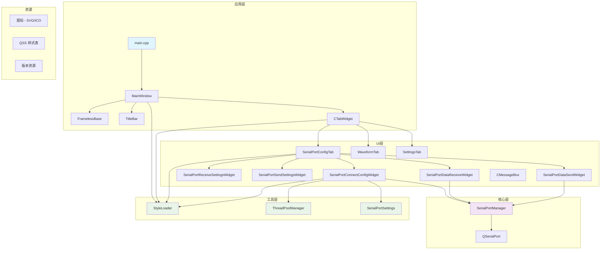
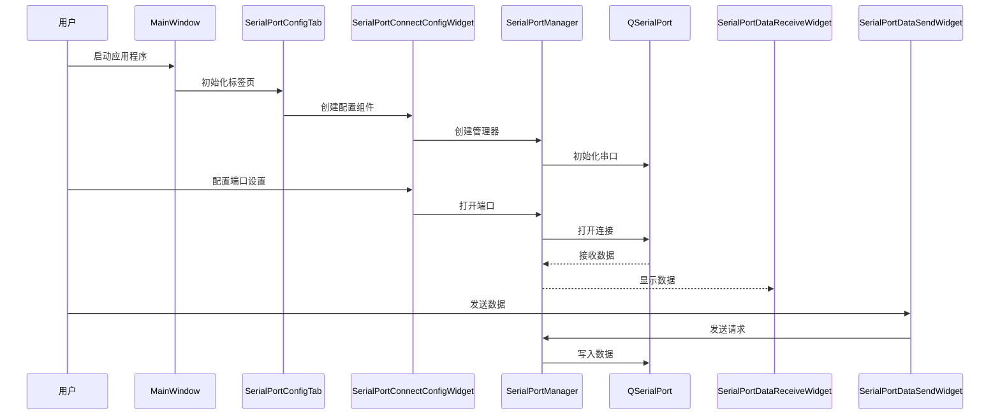

# IKUN 串口调试工具

一个基于 Qt6 和 C++20 构建的现代化、功能丰富的串口调试工具。该应用程序为串口通信提供了直观的界面，支持多种数据格式、实时监控、数据保存和可定制的样式系统。

## 🚀 核心特性

### 🖥️ 现代化界面
- **无边框窗口**: 自定义 FramelessBase 基类，支持窗口拖拽和边缘调整大小
- **自定义标题栏**: 集成最小化、最大化、关闭按钮的现代化标题栏
- **标签页界面**: 三个主要功能标签页（串口配置、波形显示、设置）
- **SVG 图标系统**: 可缩放的矢量图标，支持高DPI显示

### 📡 串口通信
- **完整串口管理**: 自动检测可用串口，支持所有标准串口参数配置
- **多种波特率**: 1200-115200 bps 全范围支持
- **数据位配置**: 5-8 数据位可选
- **校验位设置**: 无校验、奇校验、偶校验
- **停止位选择**: 1位、1.5位、2位停止位
- **流控制**: 无流控、硬件流控、软件流控

### 📊 数据处理
- **双格式显示**: ASCII 和 HEX 格式实时切换
- **时间戳功能**: 可选的毫秒级时间戳显示 [HH:mm:ss.zzz]
- **数据保存**: 实时数据保存到文件，支持文件选择
- **数据清除**: 一键清除接收数据显示
- **自动滚动**: 可选的自动滚动到最新数据

### ⚡ 高级功能
- **定时发送**: 支持自定义间隔的定时数据发送
- **HEX 发送**: 十六进制格式数据发送
- **发送回显**: 可选的发送数据在接收区显示
- **多线程处理**: 异步数据读写，确保界面响应性
- **线程安全**: 使用互斥锁保护串口操作

## 📁 项目结构

```
serial_debug_tool/
├── src/                    # 源代码
│   ├── main.cpp           # 应用程序入口点
│   ├── core/              # 核心业务逻辑
│   │   └── SerialPortManager.cpp          # 串口管理核心类
│   ├── ui/                # 用户界面组件
│   │   ├── MainWindow.cpp                 # 主窗口
│   │   ├── TitleBar.cpp                   # 自定义标题栏
│   │   ├── CTabWidget.cpp                 # 标签页容器
│   │   ├── FramelessBase.cpp              # 无边框窗口基类
│   │   ├── SerialPortConfigTab.cpp        # 串口配置标签页
│   │   ├── SerialPortConnectConfigWidget.cpp    # 串口连接配置
│   │   ├── SerialPortReceiveSettingsWidget.cpp  # 接收设置面板
│   │   ├── SerialPortSendSettingsWidget.cpp     # 发送设置面板
│   │   ├── SerialPortDataReceiveWidget.cpp      # 数据接收显示
│   │   ├── SerialPortDataSendWidget.cpp         # 数据发送输入
│   │   ├── SerialPortRealTimeSaveWidget.cpp     # 实时保存状态显示
│   │   ├── CMessageBox.cpp                # 自定义消息框
│   │   ├── WaveformTab.cpp                # 波形显示标签页
│   │   └── SettingsTab.cpp                # 设置标签页
│   └── utils/             # 工具类
│       ├── StyleLoader.cpp               # QSS样式加载器
│       ├── ThreadPoolManager.cpp         # 线程池管理器
│       └── SerialPortSettings.cpp        # 串口参数配置工具
├── include/               # 头文件 (与src结构对应)
│   ├── core/              # 核心模块头文件
│   ├── ui/                # UI组件头文件
│   └── utils/             # 工具类头文件
├── resources/             # 应用程序资源
│   ├── icons/            # SVG 和 ICO 图标文件
│   │   ├── logo.svg, serial.svg, waves.svg, settings.svg
│   │   ├── send.svg, checkmark_blue.svg, down_arrow.svg
│   │   └── ikun.ico, un_dev.svg
│   ├── qss/              # Qt 样式表文件
│   │   ├── main_window.qss, title_bar.qss, tab_bar.qss
│   │   ├── serial_port_*.qss (各组件样式)
│   │   └── ...
│   └── version.rc        # Windows 版本资源
├── cmake-build-debug/     # 调试版本构建输出
├── cmake-build-release/   # 发布版本构建输出
├── Release/              # 最终发布二进制文件 (IKUN.exe)
├── tests/                # 单元测试目录 (待实现)
├── libs/                 # 外部库目录
└── CMakeLists.txt        # CMake 构建配置
```

## 🏗️ 系统架构

### 项目模块组成图

> **注意**: 如果您的Markdown渲染器不支持Mermaid图表，可以：
> 1. 在GitHub上查看（GitHub支持Mermaid渲染）
> 2. 复制代码到 [Mermaid Live Editor](https://mermaid.live/) 查看
> 3. 使用支持Mermaid的编辑器（如Typora、VS Code等）



**架构说明**:
- **蓝色**: 应用程序入口
- **紫色**: 核心业务逻辑
- **绿色**: 工具和辅助类

### 目录结构图

> **提示**: 此图表展示了项目的完整目录结构和文件组织方式

```mermaid
graph TD
    A[serial_debug_tool/] --> B[src/]
    A --> C[include/]
    A --> D[resources/]
    A --> E[cmake-build-debug/]
    A --> F[cmake-build-release/]
    A --> G[Release/]
    A --> H[tests/]
    A --> I[libs/]
    A --> J[CMakeLists.txt]

    B --> B1[main.cpp]
    B --> B2[core/]
    B --> B3[ui/]
    B --> B4[utils/]

    B2 --> B21[SerialPortManager.cpp]

    B3 --> B31[MainWindow.cpp]
    B3 --> B32[TitleBar.cpp]
    B3 --> B33[CTabWidget.cpp]
    B3 --> B34[FramelessBase.cpp]
    B3 --> B35[SerialPortConfigTab.cpp]
    B3 --> B36[SerialPortConnectConfigWidget.cpp]
    B3 --> B37[SerialPortDataReceiveWidget.cpp]
    B3 --> B38[SerialPortDataSendWidget.cpp]
    B3 --> B39[其他UI组件...]

    B4 --> B41[StyleLoader.cpp]
    B4 --> B42[ThreadPoolManager.cpp]
    B4 --> B43[SerialPortSettings.cpp]

    C --> C1[core/]
    C --> C2[ui/]
    C --> C3[utils/]

    D --> D1[icons/]
    D --> D2[qss/]
    D --> D3[version.rc]

    D1 --> D11[*.svg, *.ico 文件]
    D2 --> D21[*.qss 样式表]

    style A fill:#e3f2fd
    style B fill:#f3e5f5
    style C fill:#e8f5e8
    style D fill:#fff3e0
```



### 数据流架构图

> **说明**: 此序列图展示了用户操作从启动到数据收发的完整流程



### 详细功能模块

#### **应用层 (Application Layer)**
- **`main.cpp`**: 应用程序入口，设置应用名称为"IKUN"
- **`MainWindow`**: 主窗口类，继承自 FramelessBase，管理整体布局

#### **UI层 (User Interface Layer)**

**窗口框架组件**:
- **`FramelessBase`**: 无边框窗口基类
  - 支持窗口边缘拖拽调整大小
  - 自定义边框热区检测 (默认5px)
  - 鼠标悬停边框高亮显示
  - 完整的窗口拖拽和调整功能

- **`TitleBar`**: 自定义标题栏
  - Logo显示、最小化、最大化、关闭按钮
  - 窗口拖拽功能
  - 自定义样式支持

- **`CTabWidget`**: 标签页容器
  - 三个主要标签页：串口配置、波形显示、设置
  - SVG图标支持，24x24像素图标尺寸
  - 最小窗口尺寸：1000x700

**串口功能组件**:
- **`SerialPortConfigTab`**: 串口配置主标签页
  - 左右分栏布局：设置面板 + 数据面板
  - 集成所有串口相关功能组件

- **`SerialPortConnectConfigWidget`**: 串口连接配置
  - 串口自动检测和选择
  - 波特率、数据位、校验位、停止位、流控制配置
  - 连接/断开按钮
  - 防止ComboBox滚轮误操作

- **`SerialPortReceiveSettingsWidget`**: 接收设置面板
  - HEX/ASCII显示格式切换
  - 时间戳显示开关
  - 实时保存到文件功能
  - 清除数据和保存数据按钮

- **`SerialPortSendSettingsWidget`**: 发送设置面板
  - HEX发送格式选择
  - 定时发送功能 (可配置间隔)
  - 发送数据回显选项

- **`SerialPortDataReceiveWidget`**: 数据接收显示
  - QPlainTextEdit 大容量文本显示
  - 自动滚动功能
  - 支持数据格式实时切换
  - 线程安全的数据更新

- **`SerialPortDataSendWidget`**: 数据发送输入
  - 多行文本输入框
  - 发送按钮
  - 支持定时发送模式

- **`SerialPortRealTimeSaveWidget`**: 实时保存状态显示
  - 保存路径显示
  - 动画进度条 (带移动图标)
  - 保存状态可视化

**其他UI组件**:
- **`WaveformTab`**: 波形显示标签页 (预留功能)
- **`SettingsTab`**: 设置标签页 (预留功能)
- **`CMessageBox`**: 自定义消息提示框

#### **核心层 (Core Layer)**
- **`SerialPortManager`**: 串口通信核心管理器
  - 基于 QSerialPort 的封装
  - 线程安全操作 (QMutex 保护)
  - 原子操作标志位 (std::atomic<bool>)
  - 支持 HEX/ASCII 数据转换
  - 时间戳生成功能
  - 1MB 读取缓冲区
  - 异步数据读写处理
  - 完整的错误处理机制

#### **工具层 (Utils Layer)**
- **`StyleLoader`**: QSS样式表动态加载器
  - 支持从资源文件加载样式
  - 运行时样式更新

- **`ThreadPoolManager`**: 线程池管理器
  - 基于 Qt Concurrent 框架
  - 支持任意函数和参数的任务添加
  - 安全的线程池关闭机制
  - 自动线程数量管理

- **`SerialPortSettings`**: 串口参数配置工具
  - 标准串口参数选项定义
  - ComboBox 自动配置功能
  - 默认值设置支持

#### **资源系统 (Resources)**
- **图标系统**: 9个SVG矢量图标 + 1个ICO图标
- **样式系统**: 9个专用QSS样式表文件
- **版本资源**: Windows可执行文件元数据

### 数据流架构

1. **应用启动**: main.cpp → MainWindow → FramelessBase 初始化
2. **界面构建**: TitleBar + CTabWidget → 三个标签页创建
3. **串口检测**: ThreadPoolManager 异步检测可用串口
4. **用户配置**: UI组件 → SerialPortManager 参数设置
5. **连接建立**: SerialPortManager → QSerialPort 连接
6. **数据接收**: QSerialPort → SerialPortManager → UI显示
7. **数据发送**: UI输入 → SerialPortManager → QSerialPort 发送
8. **文件保存**: 实时数据 → 文件系统 (可选)
9. **格式转换**: ASCII ↔ HEX 实时转换显示

## 🛠️ 技术栈与特性

### 核心技术
- **编程语言**: C++20 (现代C++特性)
- **GUI框架**: Qt 6.5.3 (跨平台GUI框架)
- **构建系统**: CMake 3.30+ (现代构建工具)
- **并发处理**: Qt Concurrent + 自定义线程池
- **样式系统**: QSS (Qt Style Sheets) + SVG矢量图标
- **串口通信**: Qt SerialPort (跨平台串口支持)

### 设计模式与架构
- **分层架构**: 应用层、UI层、核心层、工具层清晰分离
- **信号槽机制**: Qt信号槽实现组件间解耦通信
- **单例模式**: ThreadPoolManager 全局线程池管理
- **观察者模式**: 串口数据变化的实时UI更新
- **工厂模式**: SerialPortSettings 参数配置生成

### 性能优化
- **异步处理**: 串口读写操作不阻塞UI线程
- **内存管理**: 智能指针和RAII原则
- **缓冲机制**: 1MB串口读取缓冲区
- **原子操作**: std::atomic 保证线程安全
- **事件过滤**: 优化用户交互响应

### Qt模块依赖
- **Qt6::Core**: 核心功能、信号槽、线程管理
- **Qt6::Gui**: 基础GUI功能、事件处理
- **Qt6::Widgets**: 窗口组件、布局管理
- **Qt6::Svg**: SVG图标渲染支持
- **Qt6::SvgWidgets**: SVG组件集成
- **Qt6::SerialPort**: 串口通信核心
- **Qt6::Concurrent**: 并发任务处理

## 🔧 构建

### 前置要求

- CMake 3.30 或更高版本
- Qt 6.5.3 或兼容版本
- C++20 兼容编译器 (MSVC 2019+, GCC 10+, Clang 12+)

### 构建说明

1. **克隆仓库**
   ```bash
   git clone <repository-url>
   cd serial_debug_tool
   ```

2. **配置 CMake**
   ```bash
   mkdir build
   cd build
   cmake .. -DCMAKE_PREFIX_PATH="path/to/qt6"
   ```

3. **构建项目**
   ```bash
   cmake --build . --config Release
   ```

4. **运行应用程序**
   ```bash
   ./IKUN.exe  # Windows
   ./IKUN      # Linux/macOS
   ```

### CMake 配置

项目使用自动 Qt 资源编译和部署：
- MOC、RCC 和 UIC 自动处理
- Qt DLL 和插件部署到输出目录
- 包含 SVG 插件支持用于图标渲染

## 🎨 自定义与扩展

### 样式定制
- **主题修改**: 编辑 `resources/qss/` 中的9个QSS文件
  - `main_window.qss`: 主窗口样式
  - `title_bar.qss`: 标题栏样式
  - `tab_bar.qss`: 标签页样式
  - `serial_port_*.qss`: 各串口组件专用样式
- **图标替换**: 替换 `resources/icons/` 中的SVG图标
- **运行时更新**: StyleLoader 支持动态样式重载

### 功能扩展指南
- **新增标签页**: 继承 QWidget，在 CTabWidget 中注册
- **串口协议**: 在 SerialPortManager 中添加协议解析
- **数据处理**: 扩展数据格式转换和显示功能
- **UI组件**: 遵循现有命名和架构模式

### 开发建议
- 使用信号槽机制保持组件解耦
- 遵循线程安全原则，使用 ThreadPoolManager
- 保持QSS样式文件的模块化组织
- 新增功能时考虑跨平台兼容性

## 📊 性能指标

- **启动时间**: < 2秒 (包含串口检测)
- **内存占用**: ~50MB (空闲状态)
- **数据处理**: 支持高达115200 bps波特率
- **缓冲容量**: 1MB串口读取缓冲
- **UI响应**: 异步处理保证界面流畅
- **文件保存**: 实时数据流保存无延迟

## 📝 许可证

[许可证信息待添加]

## 👥 开发团队

- **wangxiangyu** - 项目创始人、架构设计师、主要开发者
  - 负责整体架构设计和核心功能实现
  - 开发时间：2025年7月16日 - 至今

## 🐛 已知限制

- **测试覆盖**: 单元测试框架待实现
- **波形显示**: WaveformTab 功能为预留接口
- **设置功能**: SettingsTab 为基础框架
- **协议分析**: 暂不支持专用串口协议解析
- **数据导出**: 仅支持实时保存，缺少批量导出

## 🔮 发展路线

### 短期目标 (v2.0)
- 完善波形数据可视化功能
- 实现常见串口协议分析器 (Modbus, ASCII协议等)
- 添加数据导出功能 (CSV, TXT, JSON格式)
- 完善设置页面 (主题选择、快捷键配置)

### 中期目标 (v3.0)
- 插件系统架构
- 多串口同时监控
- 数据对比和分析工具
- 自动化测试脚本支持

### 长期愿景
- 成为专业级串口调试工具
- 支持更多通信协议 (CAN, I2C, SPI等)
- 云端数据同步和分析
- 跨平台移动端支持

## 📊 关于架构图表

本README中包含的Mermaid图表可能在某些平台上显示为代码。为了最佳的查看体验，建议：

### **支持Mermaid的平台**:
- ✅ **GitHub**: 原生支持Mermaid渲染
- ✅ **GitLab**: 支持Mermaid图表
- ✅ **Typora**: Markdown编辑器，支持实时渲染
- ✅ **VS Code**: 配合Mermaid插件
- ✅ **Notion**: 支持Mermaid代码块

### **在线查看工具**:
- 🌐 [Mermaid Live Editor](https://mermaid.live/) - 在线编辑和查看
- 🌐 [Mermaid Chart](https://www.mermaidchart.com/) - 官方在线工具

### **本地查看方法**:
1. 将Mermaid代码复制到上述在线工具
2. 使用支持Mermaid的Markdown编辑器
3. 在GitHub上查看此README文件
